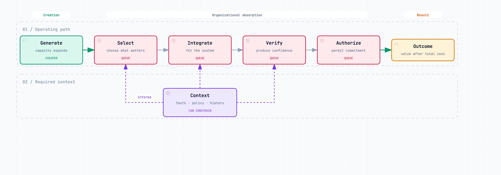

# When Production Gets Cheap {#sec-production-cheap}

A common failure as production gets cheaper is a company producing more choices than it can absorb. The outputs may be good; the company still has to select, integrate, and act on them.

Consider a founder-COO in a company of forty people. The business is preparing to add a second activity, hire another thirty people, and build its first real layer of management. A Head of Operations is taking over the daily run. This should release the COO to work on structure, capital allocation, and growth.

It does not.

The new business lead can prepare a market analysis in hours. Finance can generate several pricing and margin scenarios. Product and engineering can prototype different offers in parallel. Each team arrives better prepared. Each also arrives with a decision that crosses the boundaries of the company: which assets remain shared, which capability belongs inside the new unit, what risk the center will carry, and what evidence justifies further investment.

The Head of Operations can run the process, while the COO remains the only person with enough cross-company context and authority to resolve the tradeoffs. Teams can carry out the work; consequential decisions still collect at the center.

This is an **illustrative composite**, not a report about a particular company. Its mechanism is common enough to recognize. At forty people, the founder’s intervention can be the shortest path to a good answer. During the move to seventy, then perhaps one hundred and fifty, the same habit becomes part of the architecture. Teams learn to escalate because the founder is fast, informed, and exacting. Managers learn that initiative is welcome until it conflicts with an unstated preference. Shared functions accumulate exceptions. New ventures remain attached to the person who launched them because nobody designed the conditions for transfer to the run.

AI can intensify this dependency. It lowers the effort required to produce an analysis, option, plan, prototype, or recommendation. It does not automatically distribute the authority to choose among them. The organization has not shortened the path from intent to result. It has moved the queue toward judgment, integration, and commitment.

## A real change, stated narrowly

Speed has no organizational meaning until we specify where it occurs and what constrains the complete result. A model can answer in seconds while the company still moves through the same decision, integration, and acceptance cycles. Ask instead: “Which constraint moves when this work becomes cheaper?”

The defensible claim is narrow. The marginal cost and latency of producing *some* cognitive and software artifacts have fallen sharply. The emphasis belongs on *some*. The effect varies by task, quality threshold, workflow, and consequence.

One useful indicator is the price of model inference at a fixed level of benchmark performance. Stanford’s 2025 AI Index reported that the price for a model performing around the GPT-3.5 level on MMLU fell from about $20 per million tokens in November 2022 to $0.07 in October 2024—a decline of more than 280 times [@stanford-ai-index-2025]. Epoch AI, whose data informed that analysis, found very different rates across tasks and performance thresholds: roughly ninefold to nine-hundredfold annual declines in the cases it examined [@cottier-2025]. A September 2026 preprint argues that the measured rate depends heavily on the price unit: posted prices per token continued to fall in its sample, while its short series for estimated cost per completed task did not show a statistically clear decline [@zhu-2026-ai-price]. That result is preliminary and method-dependent. It reinforces a practical distinction: cheaper tokens do not guarantee cheaper completed work.

Inference price is also not workflow cost. A reliable system may require data access, retrieval, tools, orchestration, evaluation, security, human review, and recovery from failure. A cheap model call can sit inside an expensive operating process.

Economist Joshua Gans offers a useful discipline for thinking about that difference. He treats AI prediction as an input to a decision and examines its value alongside substitutes, complements, automation, and system effects [@gans-2025-microeconomics]. The point for an operator is straightforward: making one input cheaper does not make the complete decision cheap. The firm still needs data, judgment, and the capacity to act.

Modern generative systems stretch the prediction framing because they can produce artifacts and, when connected to tools, execute actions. The economic discipline still holds. As execution becomes cheaper, its complements become more important. A company needs to specify who may commit resources, what constraints cannot be bypassed, what evidence must return, and how a bad action can be stopped or reversed. These are not features of the model. They are features of the operating system around it.

Capability has expanded as well. METR’s latest task-horizon estimates model the task duration at which agents reach specified success probabilities on a suite of more than a hundred software tasks. The tasks are mainly in software engineering, machine learning, and cybersecurity; they are comparatively self-contained and have clear scoring rules [@metr-horizons-2026]. METR says measurements above sixteen hours are unreliable on its current suite. The result is evidence about performance on that task set, not about how long an agent can reliably run a company process. Work with tacit context, competing goals, other people, or consequential exceptions remains a different problem.

Stanford’s 2026 AI Index reports that 88 per cent of surveyed organizations adopted AI in 2025; generative AI was used in at least one business function by 70 per cent, while agent deployment remained in the single digits across nearly all functions [@stanford-ai-index-2026]. Adoption figures do not show that companies redesigned work or captured value. They show that broad use and delegated execution are different stages.

These findings justify attention. They provide no basis for declaring the autonomous company inevitable.

## Productivity belongs to a system

“Does AI improve productivity?” is usually too broad a question. Productivity depends on the worker, task, tool, process, and measure—not on the model alone.

Recent randomized field studies show why a single productivity number is misleading. In three company-run experiments at Microsoft, Accenture, and a Fortune 100 company, 4,867 developers were randomly offered access to a code-completion assistant. The pooled estimate was about 26 per cent more completed tasks (standard error: 10.3 percentage points); individual experiments were noisy and varied [@cui-et-al-2026]. This measures task completion in those software settings. It does not establish a comparable increase in releases, quality, or business value.

A separate randomized study examined sixteen experienced open-source developers working in repositories they knew well. With early-2025 tools, they took 19 per cent longer to complete 246 tasks, despite expecting the tools to save time [@becker-et-al-2025]. The sample is small and specific to its developers, repositories, tasks, and tools. It should not become a general claim that AI slows software work.

METR’s February 2026 update reports that its attempt to estimate effects from later tools was compromised by selection: some developers and tasks were missing because they preferred to use AI, while concurrent agent work made time accounting difficult. The researchers considered speedups plausible but said their new data was weak evidence of the size [@metr-uplift-2026]. Once people choose different tasks, delegate several runs, or work while agents run, time spent on a single task no longer captures the full result.

These studies differ in task, population, and measurement. The larger field experiments count completed tasks after access to a coding assistant; METR studied experienced maintainers doing work in familiar, mature repositories. Neither measures the full cost of review, integration, operation, or maintenance. DORA’s 2025 software-delivery research also reports that AI’s effects depend on the surrounding organizational system. Its survey design supports a scoped association, not a universal causal rule [@dora-2025]. For the COO, the working question is whether a specific workflow turns output into accepted work and a worthwhile outcome.

We need four different words:

| Term | Meaning | A misleading proxy |
|---|---|---|
| **Output** | An artifact or action produced: code, analysis, copy, a recommendation, a transaction | Number of artifacts generated |
| **Throughput** | Accepted work that crosses the complete operating path | Tasks started or drafts produced |
| **Outcome** | A change in customer, operational, or strategic conditions | Work shipped without measured effect |
| **Value** | The benefit of that outcome after cost, risk, maintenance, and foregone alternatives | Model cost or hours reportedly saved |

Cheap output is useful. It is not the same as throughput, outcome, or value. The difference matters to a COO because the company pays for the complete system while each team tends to report the part it produced.

## The constraint moves

At any moment, end-to-end performance is limited by one or more constraints. Expanding capacity at one constraint is valuable until another limits the result. If a company can generate analyses, designs, code, and communications much faster without changing how it chooses, integrates, checks, and authorizes them, scarcity moves elsewhere.

{#fig-moving-constraint fig-alt="An operating path from generation through selection, integration, verification, and authorization to an outcome. Context informs the middle stages. Generation is marked as cheaper; the surrounding capacities are marked as possible queues." width=100%}

The exact sequence varies. Context can shape generation or arrive later to test an option. Verification may run continuously. Low-risk actions may be authorized in advance. The diagram is not a workflow template. It identifies five capacities that cheap production can expose.

None of these capacities is new. What changes is the imbalance between them. Generative systems can increase the arrival rate of work without increasing the capacity of teams that must absorb it. Agents can also participate in the downstream steps, changing who or what selects, checks, and acts. The constraint can therefore move faster and become harder to see in conventional activity measures.

**Selection.** Which request deserves work? Which option deserves commitment? Generation creates alternatives; it does not make the opportunity cost of choosing one disappear. A portfolio of cheap experiments can still consume the scarce attention needed to stop most of them.

**Context.** Does the work reflect the organization’s current intent, facts, constraints, history, and policy? A fluent answer built from stale commercial terms or the wrong customer state is fast rework. Supplying context is not a one-time prompt-writing exercise. Context must be current, accessible, permitted, and traceable.

**Integration.** Can the output enter a product, process, data environment, or customer relationship without transferring work to someone else? A generated feature that creates a new service dependency is not finished when its code runs. A proposal that cannot survive finance, security, or delivery constraints is not organizational throughput.

**Verification.** What evidence is proportionate to the consequence? A private brainstorming note and a payment instruction should not share an evaluation regime. Verification can include tests, source checks, simulations, peer review, monitoring, or comparison with a known baseline. It need not mean inspecting everything manually. It should explain why the system is trusted enough to act.

**Authorization.** Who—or what—may publish, deploy, spend, promise, reject, or bind the company? An agent may be technically capable of taking an action without having legitimate authority to take it. Authorization converts capability into bounded institutional power.

Accountability surrounds all five. It is not another box through which work passes. It answers a different question: who remains answerable for the outcome when work is divided among people, models, software, and vendors?

For the scaling COO, these queues often collapse into one calendar. Selection arrives as portfolio review. Missing context arrives as a request to recall why an earlier promise was made. Integration arrives as conflict between a business unit and a shared function. Verification arrives as a document that needs “one final look.” Authorization arrives as a message asking, “Are you comfortable if we proceed?”

The founder experiences these as unrelated interruptions. They are often one design failure: the organization depends on a person where it needs a decision system.

## Cheap creation has an option cost

The apparent price of an additional option approaches zero long before its total cost does.

Return to the growing company. The fourth plan for the new business line may cost almost nothing to generate. It still asks the leadership team to compare assumptions, resolve conflicts with the existing business, test the economics, decide which capabilities remain shared, and state who may commit the company. Even a rejected plan can leave residue: forecasts, prototypes, provisional hires, technology choices, stakeholder expectations, and exceptions that somebody must later unwind.

A more honest cost equation is:

> **Total system cost = generation + selection + context + integration + verification + authorization + failure recovery + maintenance.**

This is not an accounting standard. It is a checklist for costs that pilots often omit. If a pilot records only license fees and minutes saved, it can report a local gain while exporting cost to reviewers, platform teams, risk owners, or future maintainers.

The opposite mistake is to demand that every use case prove enterprise-wide value before it begins. Learning also has value. A small experiment can be justified by the uncertainty it resolves. But that requires an explicit learning question and a stop decision. “We can generate it” is not a reason to keep it.

## Won’t agents absorb the new queues?

They will absorb parts of them. Agents can rank alternatives, retrieve context, open pull requests, run evaluations, and act within pre-approved limits. As capability improves, the constraint will move again.

That does not make operating design temporary. It makes operating design continuous.

An agent selecting investments still needs an objective and evidence of decision quality. An agent integrating code still needs access boundaries, tests, and a recoverable deployment path. An agent approving a refund has been given authority that must have a source, a limit, and a record. More capable execution changes where humans intervene; it does not remove the need to decide how intent, authority, evidence, and learning move through the company.

The claim also has boundaries. It is strongest in digital, decomposable, repeated work with observable results. Physical constraints may dominate manufacturing or logistics. Trust and relationship may dominate negotiation or care. Ambiguous strategy cannot be made sound merely by generating more strategic options. Stable processes should not be made fluid for the sake of appearing modern.

Production still matters. It can no longer be assumed to be the limiting step.

## What to do on Monday

Choose one recurring decision that still returns to the founder or COO. Use a real decision: a price exception, senior hire, product commitment, capital request, customer promise, or dispute between a business unit and a shared function.

1. Name the decision and the business outcome it is meant to protect. Do not name a meeting or document.
2. Write down the formal owner, then the person who makes the decision in practice.
3. Trace where the decision waits: selection, context, integration, verification, or authorization.
4. Record what the COO knows, checks, or weighs that the stated owner cannot yet access or apply.
5. Design one delegation test for the next occurrence: a clear intent, decision boundary, evidence requirement, and escalation condition. Do not silently retake the decision when the answer differs from your preference.

This exercise will often reveal a paradox: the organization is producing more while becoming harder to steer. Decisions multiply. Dependencies accumulate. Review work arrives without capacity. Exceptions live in messages and meetings. The COO remains indispensable not only because others lack skill, but because the company has stored context, judgment, and authority in one person.

That is not solved by telling the COO to let go. It is solved by making the missing operating structure explicit.

That liability is **Hidden Operational Debt**. It is where the next chapter begins.
