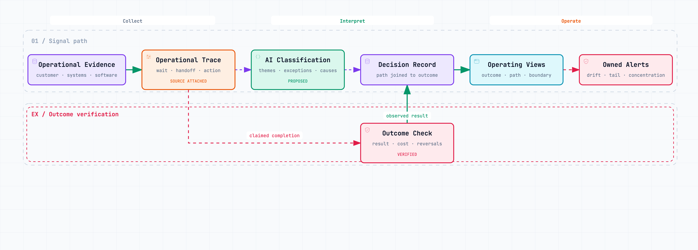

# Hidden Operational Debt {#sec-operational-debt}

Most companies already have the evidence of how they really operate. It sits in customer conversations, CRM histories, issue trackers, approval threads, incident logs, calendars, financial systems, and the software itself.

Management rarely sees that evidence as a connected record. A monthly summary may show revenue on plan, delivery broadly on time, and stable customer satisfaction while hiding the extra loops behind those results: pricing exceptions moving between functions, one product manager mediating cross-team conflicts, or the same customer problem logged under inconsistent labels.

Then the COO asks an AI assistant what is going wrong. The assistant reads a handful of documents and produces a familiar verdict: clarify ownership, improve communication, streamline processes.

The advice is broadly correct and too general to guide a decision.

Organizational debt is an emerging research concept. A 2024 review identified outdated structures, policies, and processes as one form of it, while noting that the evidence base remains small and includes practitioner writing [@al-baik-et-al-2024]. This chapter narrows the question to liabilities visible in operating traces: **what evidence shows where work is accumulating cost, and which change would reduce it?** The six categories below are diagnostic lenses developed for this book, not a validated taxonomy.

Hidden Operational Debt names this accumulated liability.

## The company is leaving a trail

Joshua Gans frames the economic effect of AI primarily through prediction and its contribution to decision efficiency [@gans-2025-microeconomics]. Inside a company, however, a better prediction has to travel through an operating path. Someone must trust the inputs, understand the tradeoff, possess the right to decide, execute the decision, and observe what happened. A cheaper prediction has little value when that path is broken.

Hidden Operational Debt is the accumulated liability in those broken paths. It appears when the way the company is expected to operate and the way work actually moves have drifted apart.

The monthly report records the eventual output. The operational trail records the struggle:

- when a request entered the system;
- where it waited;
- which information was missing;
- how many people touched it;
- which rule or precedent was used;
- when a human overrode an automated recommendation;
- whether the decision was reversed;
- what the customer experienced;
- and whether the economic result matched the original assumption.

Joining these records takes work, especially when systems use inconsistent terms, omit timestamps, or record outcomes in different places. Interviews, workshops, process maps, and operator knowledge remain necessary when the trail is incomplete. A language model can help classify tickets and decision threads, group similar exceptions, and draft a map of where the operating path breaks. Its classifications still need to be checked against source records.

This can make a first-pass review faster. Operators still need to catch misclassified exceptions, missing political context, and correlations presented as causes. The model helps them inspect more records and find patterns for closer review.

Keep source events attached to each proposed pattern so the operating owner can check the summary against the underlying cases.

## Debt has an observable fingerprint

The six categories below are search lenses, not a maturity model. A single workflow can show evidence of several kinds of debt, and AI use may affect each one differently.

| Debt | Signals already present in the business | Possible AI-related pressure to test |
|---|---|---|
| **Decision** | Queue time, repeated approvals, executive escalations, overrides, reversals | More recommendations may reach the same unresolved decision boundary |
| **Context** | Missing fields, conflicting sources, stale policies, time spent reconstructing history | Weak or outdated context may be repeated in fluent answers |
| **Coordination** | Handoffs, blocked work, reopened tasks, dependency chasing, recurring alignment meetings | More work may start in parallel and arrive at shared dependencies sooner |
| **Integration** | Manual re-entry, reconciliation, failed syncs, bespoke handoffs, local data copies | Agents may reproduce brittle interfaces and workarounds at higher volume |
| **Knowledge** | Repeated questions, rediscovered failures, undocumented rationale, inconsistent onboarding | Generated content may grow faster than reusable judgment |
| **Control** | Permission exceptions, missing evidence, after-the-fact approvals, unowned incidents | Action volume and access may grow faster than review capacity |

Use the categories to look for recurring evidence, not to assign a score. One broken path can involve several forms of debt. A contract held up for days may involve missing margin data, unclear discount authority, and a manual transfer between the CRM and finance model. Forcing it into a single category would obscure the causes.

The categories matter because the remedies differ. Decision debt is not repaired by a better summary if nobody has authority. Context debt is not repaired by delegation if the delegated owner cannot trust the numbers. Coordination debt is not repaired by another integration when the teams have incompatible priorities.

## Record the liability before choosing a remedy

An operational-debt register makes a suspected liability reviewable. The word *principal* means the unresolved design gap that remains in the system. *Interest* means the recurring work or exposure that gap creates. Neither is a financial valuation by itself. Keep measures in their natural units—waiting days, repeated handoffs, manual checks, reversals, margin variance—until there is a defensible way to convert them into money.

| Register field | What to record |
|---|---|
| **Workflow and outcome** | The work path and result it is meant to produce |
| **Observed liability** | Where actual work diverges from the intended path |
| **Evidence** | Source records, dates, sample, and missing data |
| **Principal** | The unresolved context, decision, coordination, integration, knowledge, or control gap |
| **Interest signal** | The recurring wait, rework, escalation, exception, loss, or risk tied to the gap |
| **Owner** | The person accountable for the workflow and able to change it |
| **Test** | The smallest intervention and the evidence that would show whether it helped |
| **Review or expiry** | When to inspect the result, continue, revise, or stop |

For a pricing exception, the principal might be the absence of an authoritative cost source and a clear discount boundary. Its interest signals could be repeated finance checks, COO escalations, delayed proposals, and differences between expected and realized margin. The register does not assume these events share one cause; the owner checks the records, names a test, and revisits the claim after the next set of decisions.

One hypothesis is that agents can change the rate at which unresolved work reaches a boundary. They can prepare analyses, write code, contact suppliers, or launch campaigns; whether this increases total pressure depends on demand, controls, and workflow design. Measure the volume and cost at the boundary instead of assuming the effect.

The 2025 DORA report describes AI as amplifying conditions in software-delivery organizations [@dora-2025]. Extending that finding to other operating systems is a hypothesis in this book. Test it in each workflow by tracking accepted work, rework, and outcomes before and after a change.

## Real practice: agent builders trace the path

Public examples from agent-product teams show how operators can inspect more than a final answer. They retain the trace: input, retrieved context, intermediate actions, tool calls, handoffs, errors, human feedback, and final state.

Anthropic's current evaluation guidance separates interaction quality from end-state checks. For a support agent, an evaluation can check whether the ticket is resolved, whether the requested action occurred, which tools were called, and how long the interaction took [@anthropic-agent-evals-2026]. A transcript that says "done" does not establish that the customer or operating system reached the intended state.

That distinction belongs in the company's operating model. A team can report that a customer issue was resolved; the outcome may be a repeat contact later. A business-unit lead can report that a pricing decision was delegated; the trace may show that the COO rewrote the recommendation in a private message. A product team can close a feature request; the outcome may be lower activation because the underlying customer problem was misunderstood.

One product example shows why metric definitions need their own evidence trail. In 2026, Intercom changed how it counted conversations in its Fin agent's involvement and resolution rates. It excluded cases where the agent was active but never had a chance to answer, because including them distorted both rates; its overall automation rate did not change [@intercom-fin-reporting-2026]. This is vendor documentation, not independent evidence of customer outcomes. It does show how a denominator can hide constrained cases and change what a dashboard appears to say.

Current observability tools can group sampled production traces into categories, retain links to source traces, and compare error rates, latency, cost, and evaluator feedback across categories [@langsmith-insights-2026]. The operating practice is portable across tools: keep the path, connect it to the outcome, and make recurring exceptions visible.

Companies can apply the same discipline outside an AI product. A pricing approval, supplier exception, customer onboarding, incident response, or new-business launch is also a trace. It has a trigger, context, steps, decisions, exceptions, actors, and an outcome. Once that record is available, AI can help interpret it continuously.

## The dashboard should show strain, not activity

Most executive dashboards describe results after the operating system has absorbed the cost. Revenue arrived. Tickets closed. Features shipped. Hiring completed. The company may be hitting those numbers through escalation, rework, and executive intervention that will not survive another doubling in volume.

{#fig-operational-debt-signals fig-alt="A signal path from operational evidence to an operational trace, AI classification, a decision record, operating views, and owned alerts. A separate outcome check verifies the claimed completion and feeds the decision record." width=100%}

An operational-debt dashboard sits beneath the result. It should let a leader move through three views.

The first is the **outcome**. Did the customer's problem stay resolved? Did the deal produce the expected margin? Did the release improve the intended behavior? Did the new business line consume the shared capacity assumed in its model? A proxy such as "task completed" is not enough when the real result can be checked.

The second is the **path**. How long did the work wait compared with the time spent doing it? How many handoffs occurred? How often was an item reopened, reversed, or escalated? Where did the path diverge from policy? Which step repeatedly lacked context?

The third is the **system boundary**. What did people decide, what did agents execute, and where did control move between them? Useful measures include autonomous completion without correction, human intervention, policy exceptions, failed tool calls, missing evidence, and cost per successful outcome. Adoption is not a result. A high rate of AI use can coexist with poor economics and more rework.

No universal set of thresholds exists. A safety-critical approval and a low-value customer refund should not have the same path. Medians can also hide the cases that consume executive attention, so distributions matter. A COO often learns more from the longest-waiting consequential decisions than from average decision time.

The dashboard therefore needs drill-down, not decorative precision. Every aggregate should open into the events behind it. If escalations rise, management should be able to see whether they cluster around one rule, customer type, business unit, data source, or agent action. If the system cannot provide examples, the chart is not ready to govern anything.

## Illustrative example: a new business line seen through its traces

Consider a company moving from one activity to several. The founder-COO launches the second business line personally, then appoints a business-unit lead and hands delivery to a Head of Operations. The organization chart says responsibility moved. Pricing behavior says otherwise.

The usual dashboard shows pipeline, bookings, gross margin, and perhaps the number of deals awaiting approval. It does not explain why pricing keeps returning to the founder.

The company already has most of the required evidence. The CRM holds the proposed price, customer segment, dates, owner, and deal result. Finance holds the cost assumptions. The contract system records non-standard terms. Product and operations systems expose capacity constraints. Email or messaging threads contain the exception rationale and the moment the COO became involved.

An AI analysis can turn the unstructured parts into proposed events: exception reason, missing context, policy cited, people consulted, decision made, and rationale. Those fields should be sampled and corrected by the operators who understand the process before they become metrics. Once calibrated, the analysis can run across the full period.

The resulting view might show:

- pricing-exception volume and rate by business unit and customer segment;
- median and tail decision time, separated into working time and waiting time;
- number of handoffs and requests for missing information;
- share of exceptions escalated to the COO, with the reasons for escalation;
- concentration of decisions by person, rule, and shared dependency;
- margin at approval compared with realized margin;
- reversals, contract amendments, and repeat exceptions for the same cause;
- deals lost or delayed while an exception remained open.

Now management can distinguish several stories that previously sounded identical. If most delays occur because shared-asset cost is unavailable, transferring pricing authority will not solve the problem. If the data is present but the business-unit lead escalates every deviation from the founder's preference, the liability sits in decision rights or behavior. If an agent proposes discounts inside the agreed envelope but humans repeatedly override them without recording why, the company has created an unobservable control loop.

Alerts should emerge from those stories. The system might flag a new cluster of exception reasons, a material change in tail decision time, repeated use of a stale cost model, an unusual rise in reversals, or growing concentration of approvals around one executive. The threshold must be agreed by the owner and calibrated against the company's own baseline. "Red" should mean that someone knows what to inspect and has the authority to respond.

Managers can use this dashboard to check whether decisions moved, outcomes remained acceptable, and another constraint formed elsewhere.

## Ask AI to build the first version

The first operational-debt view does not require a transformation program. It needs a consequential workflow, enough history to reveal recurrence, and access to an approved AI environment. Sensitive customer, employee, financial, and contractual data should be minimized or anonymized, and only placed in a system the company permits for that information.

Choose one path that is already causing concern: pricing exceptions, customer onboarding, incident resolution, supplier approval, or product requests. Export the last several months of records from the systems involved. Include timestamps and outcomes, not only narrative descriptions. Add the current policy, decision-rights document, or operating rule if one exists.

Then give an approved model a brief like this:

> **Act as an operating-system analyst.** Analyze the attached, anonymized records for one workflow. Reconstruct the common path from trigger to outcome. Identify recurring waiting, handoffs, missing context, escalations, reversals, exceptions, manual reconciliation, and control failures.
>
> For each pattern, separate: (1) what is directly observed in the records, (2) what you infer, and (3) what data is missing. Link every finding to representative source records. Do not rank employees or treat activity volume as performance.
>
> Produce four outputs: a proposed event schema; a ranked set of operational-debt hypotheses; a dashboard specification with metric definition, source, owner, and drill-down; and alert rules calibrated to the observed baseline. Connect path measures to customer, quality, or economic outcomes wherever the data permits. State clearly where no causal conclusion is possible.

Expect the first response to expose data gaps and ambiguous definitions. Have the operating owner resolve those questions before asking the model to generate transformation logic, queries, or formulas.

Then make the build request explicit:

> Using only the validated fields, generate a working local dashboard or an implementation specification for our existing BI tool. Create three views: outcome, operating path, and human-agent boundary. For every metric, show the formula, data source, refresh cadence, owner, and links to the underlying records. Add alert logic for changes against our baseline. Do not invent unavailable fields; list them as instrumentation gaps.

The exact output may be an HTML prototype, SQL and chart definitions, or a specification for Power BI, Looker, Metabase, or the company's existing tool. There is no reason to begin with a new platform.

Before relying on the result, sample each major pattern and compare the classification with the source material. Keep the corrections as evaluation examples, and add new failures as they appear. Production-agent teams use the same practice to build tests from real traces.

Schedule the analysis to match the workflow's cadence. Let the system surface new clusters and threshold breaches. The owner inspects the underlying cases, decides whether a liability is real, and records the intervention. Then compare the path and outcome over time.

A dashboard that detects recurring debt but cannot trigger a decision becomes another source of operational debt.

## From reporting to an operating instrument

Operational visibility can easily become surveillance. Measuring handoffs and delays at individual level invites gaming and punishes the people who absorb the hardest exceptions. The unit of analysis should normally be the workflow, decision boundary, policy, interface, or recurring condition. Individuals appear when they own the remedy, not as targets on a leaderboard.

AI-generated categories can harden a weak interpretation. Preserve samples, let operators challenge classifications, and show confidence and missing data. When financial or customer consequences are uncertain, say so. Avoid a single debt score; use the evidence to shorten the path from signal to investigation to operating change.

Once that path exists, Hidden Operational Debt stops being an annual workshop topic. It becomes observable state. Customer conversations reveal where policy and product diverge. Software logs reveal where work repeatedly fails or returns. Decision traces reveal where delegation is nominal. Agent traces reveal where autonomy exceeds control or where humans are still paying invisible interest.

The practical question becomes: **Where does the company lose the connection between sound information, a decision owner, and a verified result?**

That question leads to the boundary between adding an AI tool and changing how the company operates. It is the subject of the next chapter.
