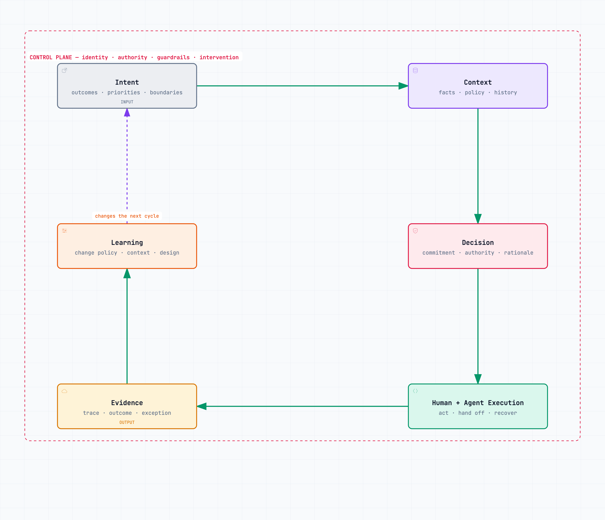

# ATOM: Intent In, Evidence Out {#sec-atom}

An operating model should be drawable without a slide deck.

This book proposes six connected layers and one control plane for describing an operating loop. Read them clockwise:

1. **Intent** states the outcome, priority, boundaries, and time horizon.
2. **Context** supplies the authorized facts, policy, history, and current state.
3. **Decisions** convert intent and context into a committed choice.
4. **Execution** combines people, deterministic software, workflows, and agents.
5. **Evidence** records what happened and what result followed.
6. **Learning** changes the relevant assumption, context, policy, capability, or strategy.

The **control plane** crosses the loop. It provides identity, permissions, limits, approvals, monitoring, intervention, rollback, and accountability.

{#fig-atom-canonical fig-alt="A compact clockwise loop connecting Intent, Context, Decision, Human and Agent Execution, Evidence, and Learning. The complete loop sits inside a control-plane boundary containing identity, authority, guardrails, and intervention." width=88%}

The rest of the book develops this proposed model and shows where each part is useful.

The loop can be entered from two directions. Leadership can begin with intent: a strategic outcome that needs an operating path. Operations can begin with evidence: a recurring failure, customer signal, or exception that reveals the present system. In both cases, ATOM asks the company to connect the whole cycle. Strategy without returning evidence becomes instruction. Evidence without a route to authority becomes reporting.

## Intent is a usable constraint

“Grow efficiently” is not intent. It does not tell a team what to trade away, which customer matters, or how long the choice should hold.

Usable intent names an outcome and its boundary. A new business unit might be asked to prove that a particular customer problem can support a positive contribution margin without consuming more than a stated amount of shared engineering capacity. The unit now has room to act and a reason to refuse attractive work that violates the experiment.

Intent is not a cascade of slogans. It is a constraint that makes local decisions coherent.

A useful intent statement contains tension. “Increase adoption” invites activity. “Increase activation among mid-market customers without raising implementation effort per account” names a result and protects an operating condition. Teams can now reject a feature that attracts sign-ups but increases manual setup. An agent can search for options without being allowed to redefine the tradeoff.

Intent also has a shelf life. A temporary cash constraint should not remain embedded in agent policy after financing changes. A market-entry priority should not silently govern a mature business. The owner and review date belong beside the statement.

## Context is governed state

Context includes live business data, policy, customer history, commitments, prior decisions, and the state of the work. It also includes provenance: where the information came from, when it was updated, who owns it, and who may see it.

More context is not always better. An agent handling a refund does not need the entire customer data lake. It needs the current account state, the applicable policy, relevant interaction history, and authority limits. Excess context raises cost, creates privacy exposure, and makes conflicts harder to detect.

Context is where many implementations hide organizational choices inside technical retrieval. Selecting an “authoritative” document decides which function's view governs. Setting freshness decides how long the company tolerates drift. Granting access decides which actor can combine sensitive facts. These are operating decisions implemented through infrastructure.

## A decision is a commitment

Analysis becomes a decision when an authorized actor commits the company. The actor may be a person, a deterministic rule, or an agent acting within delegated bounds. ATOM does not assume the human always makes the final call. It requires the source and limit of authority to be explicit.

Every recurring decision should expose its owner, inputs, criteria, consequence, reversibility, evidence requirement, and escalation path. Without these, an agent may offer advice but cannot receive legitimate autonomy.

Decision design also clarifies the role of the center. The center should not decide every case shared functions care about. It should define the enterprise constraints, resolve conflicts among units, and own decisions whose consequences cross the whole company. Local owners decide inside that space.

## Execution is a designed combination

Execution belongs to the system best suited to the work. Deterministic software handles stable rules. Models interpret ambiguity. Agents manage bounded multi-step work. People set intent, exercise judgment, negotiate conflict, absorb legitimate exceptions, and remain accountable.

The design question is not “human or AI?” It is where each hands work to the other, what state transfers, and what happens when the receiver cannot proceed.

Execution may run in parallel. Several agents can research, test, or prepare options at once. The operating path still needs a convergence point: a decision, accepted artifact, verified state, or stopped run. Parallelism without convergence creates more outputs than the company can integrate.

## Evidence is an output

ATOM produces two outputs: a business result and evidence about how the result was produced. Evidence includes source versions, decisions, approvals, actions, tool responses, exceptions, cost, and outcome measures. Its depth should match the consequence.

An organization that only records the final answer cannot distinguish a lucky result from a reliable system. It also cannot investigate harm, improve an agent, or defend the decision later.

Evidence is selective, not total surveillance. The company does not need to retain every internal token or employee action. It needs the material facts required to reconstruct a consequential result. Retention, access, and deletion are themselves control decisions.

## Learning has an owner

Learning is not a generic retrospective. Evidence may suggest that the model needs a new evaluation, the context source needs repair, a permission is too broad, a decision threshold is wrong, or the strategy itself failed. These changes belong to different owners. Letting one agent rewrite all of them would collapse learning and control into the same authority.

ATOM closes the loop by sending approved changes to intent or context. It does not let every observation alter production behavior immediately. When a lesson should carry to other loops, an owner can add it to the **ATOM Playbook**: a maintained set of decision specifications, context definitions, controls, evaluation cases, and operating lessons. The Playbook is curated organizational memory, not a transcript archive.

## One refund through the loop

**Illustrative example.** Take a customer who requests a refund after a service failure.

**Intent** says the company will restore trust quickly while protecting against fraud and preserving consistent treatment. **Context** provides account state, transaction history, service incident, current refund policy, customer communications, and verified identity. **Decision** grants an agent authority to approve standard refunds below a threshold when the service failure and identity are confirmed. **Execution** issues the refund through a payment tool, informs the customer, and opens a service-quality record. **Evidence** retains the sources, policy version, decision, action result, and later repeat contact. **Learning** may reveal that one failure category is creating avoidable refunds and route that pattern to the product owner.

The control plane binds each step. The agent uses a scoped identity. It cannot change the policy or send money to a different account. A high amount, identity conflict, or vulnerable-customer flag routes to a person. The customer can challenge the result.

Now alter one condition. The payment system confirms success, but the account ledger fails to update. Execution is only partly complete. Evidence should make the split state visible and trigger recovery. A dashboard that records the agent's tool call as a successful refund would teach the organization the wrong lesson.

This example is small enough to draw and exposes the architecture. Similar questions arise in capital allocation, production incidents, hiring, and new-business experiments. The required context and controls depend on the consequences; this loop is a design proposal, not evidence that one template fits every decision.

## What ATOM is not

ATOM is not an autonomous company. Organizations contain power, conflict, law, identity, trust, and consequences that cannot be reduced to a feedback diagram.

It is not a technology stack. A company can implement the loop with ordinary databases, workflow tools, meetings, and carefully bounded assistants. New infrastructure is justified only when the current tools cannot provide the needed context, action, or evidence.

It is not a replacement for Lean, Agile, product operating models, or sound functional management. It draws on their concern for flow, feedback, customer value, small batches, and capable teams. This book's proposed contribution is to make decision rights, machine actors, evidence, and control explicit in one operating loop.

ATOM also resists a weakness common to feedback metaphors: the assumption that the measured target is the right one. A tight loop can optimize the wrong outcome with great efficiency. Leadership remains responsible for choosing intent, listening to people the metric excludes, and stopping a locally successful system that damages the wider company.

Nor is ATOM the org chart. The same loop can operate inside a function, across a customer journey, or within a business unit. At scale, repeated loops can form semi-autonomous units, provided their interfaces and central constraints are clear.

The shortest definition is therefore the most useful:

> **ATOM is a governed learning loop that converts intent and authorized context into decisions, human-agent execution, and evidence.**

A reader should now be able to draw it. Start with the six layers. Draw the return from learning. Place control across the path. If an implementation cannot say what enters, who may decide, what may act, what proof returns, and who may change the system, it is not yet an ATOM loop.

When mapping a real workflow, use the diagram as an interrogation device. Ask an approved AI assistant to infer the six layers from actual records, then mark every answer that is absent, contradictory, or merely assumed. The blank spaces usually matter more than the polished map. They show where the company is depending on private memory, informal authority, or unobserved recovery work.
