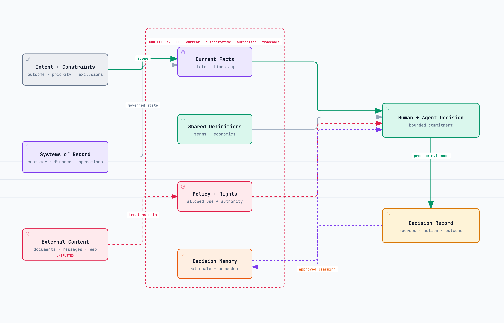

# Context Is Infrastructure {#sec-context}

The first failure of an agent is often blamed on the model. Inside a company, the failure more often begins with the material the model was allowed to see.

Imagine a supplier-selection agent. It compares price, lead time, and defect history and recommends the incumbent. The answer is well reasoned. It is also wrong. The contract repository contains an old agreement, the current sanctions policy lives in a legal memo, and the operations system uses a different supplier identifier. A senior buyer notices the conflict because she remembers the negotiation.

Calling this a hallucination would let the company avoid the real issue. The agent acted on a context product the organization never designed.

Humans have always compensated for poor organizational context. They remember that the dashboard is late, know which spreadsheet contains the real forecast, call the person who negotiated the exception, and reinterpret the rule according to what happened last quarter. That hidden reconstruction is expensive, but it is also forgiving. An experienced operator can notice that two records which look identical are not the same customer.

Agents make context debt visible. They can retrieve more material and connect it faster, but they do not inherit the unwritten map of authority that lives in an operator's head. Giving them access to every repository does not solve this. It increases the number of plausible mistakes they can make.

## The context envelope

ATOM gives each recurring decision or task a **context envelope**. It is the smallest body of current, authorized, attributable information required to do the work.

| Part | Question |
|---|---|
| **Task state** | What is happening now, and what has already happened? |
| **Enterprise facts** | Which business data is required, and which source is authoritative? |
| **Policy** | Which rules, thresholds, and obligations apply? |
| **History** | Which prior decisions, commitments, and outcomes matter? |
| **Provenance** | Where did each item come from, who owns it, and how fresh is it? |
| **Access** | Who or what may retrieve, combine, retain, or disclose it? |

The envelope is deliberately smaller than “company knowledge.” A pricing decision does not need the whole CRM, every call transcript, and the complete finance warehouse. It may need the customer's current segment, contracted terms, payment status, service cost, available capacity, relevant commercial policy, and the last approved exception. Everything else competes for attention, raises privacy exposure, or creates another possible conflict.

{#fig-context-envelope fig-alt="Intent, systems of record, and untrusted external content feed a bounded context envelope containing current facts, shared definitions, policy and rights, and decision memory. The envelope supports a human and agent decision, which produces a traceable decision record and approved learning." width=100%}

This is not merely an architectural preference. Teams building long-running agents now describe context as a finite resource that must be curated. Anthropic's engineering guidance distinguishes context engineering from prompt engineering: the job is to select and maintain the system instructions, tools, external data, history, and memory most likely to produce the desired behaviour. It also warns that simply increasing the amount of context can reduce focus and retrieval precision [@anthropic-context-engineering-2025]. The organizational implication is more important than the model behaviour. Someone must decide what deserves to become context, under whose authority, for how long, and for which decision.

Retrieval is not truth. A search system can return an obsolete policy with perfect semantic relevance. A long conversation can contain a decision that was later reversed. A model can merge two customer records into one fluent account. Context has to be governed before it is generated into prose.

## Four tests before information enters the envelope

Each item admitted to a consequential decision should survive four tests.

**Relevance.** Does this fact change the decision or the confidence required? “It might be useful” is not enough. Excess material hides the few facts that matter.

**Authority.** Is this the source that governs the issue? A slide describing the discount policy is not equivalent to the approved policy. A CRM note about a contractual promise is a signal to check the contract, not a substitute for it.

**Freshness.** Could the fact have changed since it was validated? Freshness is defined by the work. Yesterday's warehouse capacity may be stale for dispatch but adequate for a quarterly footprint review.

**Permission.** Is this actor allowed to access and combine the information for this purpose? Access to two systems separately does not automatically authorize joining their data. Nor does the ability to read a record imply permission to retain it in agent memory.

These tests turn a retrieval pipeline into an operating contract. When one fails, the system should retrieve a better source, reduce its confidence, request clarification, or stop. It should not hide the gap behind fluent language.

## Separate memory by purpose

Organizations often ask for an agent “with memory,” as if memory were a single feature. It is better to separate at least four kinds.

**Working state** lasts for the task: what has been tried, what remains open, and what each tool returned. It should make interrupted work resumable without turning a scratchpad into a permanent corporate record.

**Relationship memory** retains permitted facts about an account, supplier, employee, or counterparty. It needs ownership, correction, retention, and visibility rules. A useful customer preference may still be personal data.

**Institutional memory** preserves policies, precedents, decisions, and outcomes. It is not a document archive. It is a maintained account of what the organization has decided, why, and what superseded it.

**Learning memory** contains examples used to test or improve the system: successful cases, edge cases, overrides, incidents, and deliberately difficult scenarios. Its purpose is evaluation, not live decision-making.

The separation matters. A failed agent trace may belong in an evaluation set but not in the next customer's prompt. A customer's preference may belong in an account record but not in a general training corpus. A temporary exception may inform one task without silently becoming precedent.

Memory also needs a forgetting mechanism. Wrong facts that remain easy to retrieve acquire institutional weight. Expired exceptions become shadow policy. A corrected customer record survives in a conversation summary. The design question is therefore not only, “What should the agent remember?” It is, “What has the authority to make it forget?”

## Make conflict visible

Every authoritative source used for consequential work should answer four questions: Who owns it? When was it last validated? What does it govern? What replaces it?

If two sources conflict, the agent should not silently choose the one with the clearer wording or later timestamp. It should apply a declared precedence rule or stop. If a source has expired, the system should surface that fact at the point of use. If a human supplies an exception, the exception should have scope, rationale, owner, and duration rather than becoming an invisible new rule.

The NIST Generative AI Profile treats governance, content provenance, data privacy, testing, and incident handling as lifecycle concerns rather than prompt-level features [@nist-genai-profile-2024]. That framing is useful for operators. The quality of context depends on work that happens outside the model: defining records, assigning ownership, resolving contradictions, controlling access, and maintaining sources.

This can feel slower than connecting an agent to a drive and seeing it answer questions in an afternoon. The difference appears when the answer changes a price, blocks a shipment, commits capacity, or sends a customer message. At that point, a source map and a precedence rule are not administrative overhead. They are part of the product.

## Untrusted content is not instruction

An agent may need to read customer emails, supplier documents, web pages, and support tickets. Those materials can contain requests and evidence. They can also contain instructions—malicious or accidental—that conflict with the organization's intent.

The security problem is easy to miss because the same model reads both trusted directions and untrusted content. OpenAI describes prompt injection as a form of social engineering and recommends limiting access to the minimum data and capability required. Its more recent design guidance frames the dangerous combination as an untrusted **source** connected to a consequential **sink**, such as transmitting data or invoking a tool [@openai-prompt-injection-2026].

ATOM handles this in the envelope. Each source has a trust class. Retrieved content supplies facts; it does not acquire authority to change the task. Tools enforce permissions outside the prompt. A supplier PDF can state a new bank account, but it cannot authorize the payment system to use it. A customer message can request a refund, but it cannot alter the refund ceiling. The action still has to pass the decision specification and the control plane.

## Build context as a product

A context product has users, an owner, a service expectation, and quality measures. The pricing context product for a business unit might join current cost, available capacity, standard terms, customer segment, outstanding commitments, and the discount policy. Finance owns cost definitions; operations owns capacity; commercial leadership owns the decision envelope. The context product brings those facts together without pretending one function owns the whole truth.

Its measures should expose whether the organization can supply usable state:

- source freshness and coverage;
- retrieval success for required fields;
- unresolved conflicts between authoritative sources;
- missing or ambiguous entity identifiers;
- permission denials and unusual access combinations;
- decisions delayed by manual context reconstruction;
- reversals caused by missing or stale context;
- and the proportion of outputs whose claims can be traced to a source.

These are not model benchmarks. They reveal the condition of the operating system around the model.

The product also needs a change path. When finance modifies the cost definition, who tests the pricing decisions affected by it? When a policy changes, which agents and human workflows receive the new version? When an operator discovers an important exception, how is it reviewed and either codified or allowed to expire? Without that maintenance loop, the initial integration becomes another source of debt.

## What to build this week

Start with one recurring decision, not a company-wide knowledge graph. In an approved AI workspace, provide the blank decision template from the field kit and samples of the materials currently used by the people who make that decision. Where policy permits, add structured exports with sensitive fields removed or masked.

Ask the assistant to produce five outputs:

1. a source map showing each required fact, its current location, owner, and update frequency;
2. a conflict report listing duplicate definitions, stale documents, identifier mismatches, and unresolved precedence;
3. a proposed context envelope separating required, optional, and prohibited information;
4. a machine-readable source manifest with owner, freshness rule, trust class, and access scope;
5. ten test questions whose answers should fail when an essential source is missing, stale, or contradictory.

Do not ask the model to settle ownership disputes. Ask it to find them. Source owners then validate the map, decide precedence, and set failure behaviour. Connect the agent only after the envelope survives those tests.

An agent's autonomy cannot exceed the authority and quality of its context. Once context is treated as infrastructure, experienced judgment becomes easier to distribute. The company no longer depends on each operator remembering which part of the official system is unofficially wrong.
