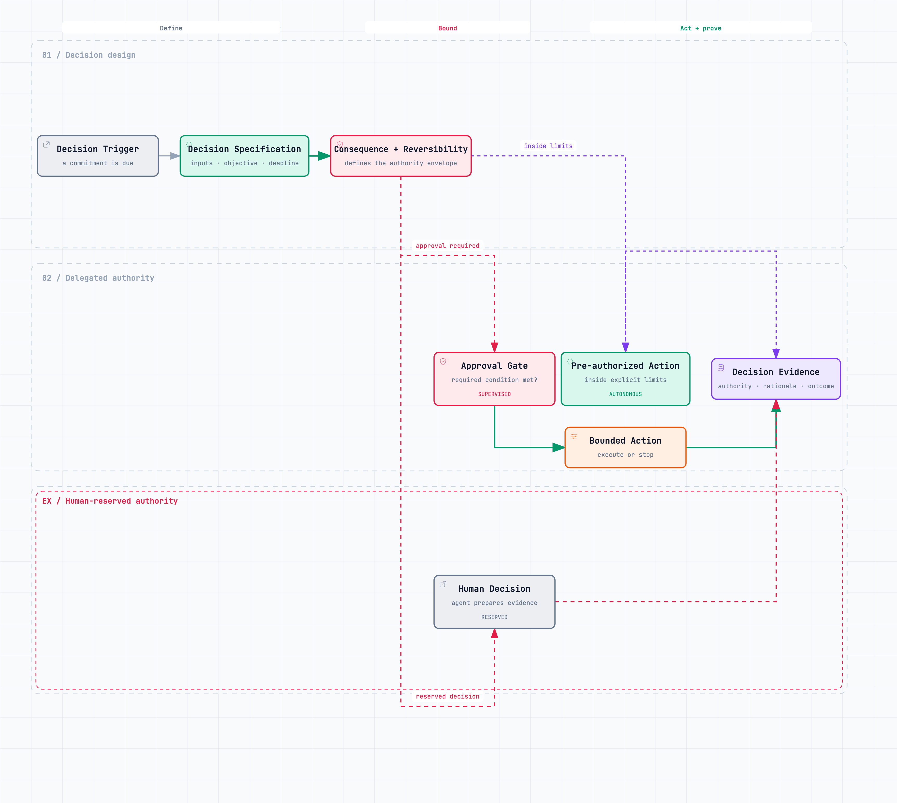

# Design the Decision Before the Agent {#sec-decisions}

Companies frequently delegate work without delegating the decision. A manager prepares the recommendation, collects the evidence, and coordinates the stakeholders. The founder still chooses. Installing an agent in that arrangement gives the manager faster preparation and the founder more decisions to absorb.

The founder may feel less overloaded at first because the briefs arrive cleanly. Soon they arrive more often. Cheaper analysis lowers the threshold for asking for analysis. Options multiply. Every team can generate a convincing case. The approval queue becomes the last scarce resource.

The remedy begins before the agent is selected. Design the decision.

## Inventory commitments, not meetings

A decision inventory records moments when the company commits money, capacity, access, reputation, or a course of action. “Weekly pricing committee” is not a decision. “Approve a discount outside the standard envelope” is. “Product review” is not a decision. “Move three engineers from the core product to the new business for six weeks” is.

This distinction sounds simple until leaders attempt the inventory. Calendars show where discussion occurs, not where commitment happens. Many commitments are hidden inside process steps: a sales promise entered as a note, a hiring profile approved through silence, a delivery date accepted when nobody challenges it. Other meetings revisit decisions that were supposedly delegated.

For each recurring decision, record:

- the outcome it protects;
- the accountable owner;
- required inputs and their authoritative sources;
- criteria and prohibited conditions;
- consequence if wrong;
- reversibility and cost of reversal;
- time available;
- authority granted to people, rules, and agents;
- evidence retained;
- escalation and appeal;
- and the date the design itself will be reviewed.

The inventory often exposes phantom delegation. A business-unit lead owns the result but cannot approve price, hire within budget, or commit shared capacity. Accountability moved on the organization chart; authority stayed at the centre.

It can also expose orphaned decisions. Everyone contributes analysis, but nobody is clearly entitled to decide. The issue climbs until a senior leader absorbs it. What looks like a need for better collaboration is sometimes a missing owner.

## A decision has more than an answer

An operational decision is a small system. It starts with a trigger, builds a state from evidence, evaluates alternatives, applies values and constraints, commits an action, and creates consequences that should be observed. The answer—approve, reject, price, route, hire, allocate—is only one event in that system.

This is why automating an answer can fail even when the answer is statistically good. The trigger may be wrong. The inputs may omit a promise. The action may exceed authority. Nobody may observe whether the result was useful. The company has improved prediction without improving the decision.

Joshua Gans's microeconomic treatment of AI is valuable here because it separates prediction from the complementary parts of a decision. When prediction becomes cheaper, judgment, action, data, and the design of the surrounding system can become more valuable [@gans-2025-microeconomics]. A model can estimate churn or delay. The company still decides which errors matter, what it owes the affected party, and which action is legitimate.

The practical unit of design is therefore not “an AI use case.” It is a recurring commitment with an owner and a feedback path.

## Consequence and reversibility shape autonomy

Not all uncertainty deserves a human approval. A low-cost, reversible action can often be delegated with monitoring. A consequential but reversible action may be executed within a budget and reported immediately. An irreversible or rights-affecting decision usually deserves stronger review, separation of duties, and recourse.

| Consequence | Reversibility | Default design |
|---|---|---|
| Low | Easy | Act within policy; log the result |
| Material | Easy | Act within limits; monitor and sample |
| Low | Difficult | Propose or require approval |
| High | Difficult | Named human decision, strong evidence, independent control |

This is a starting posture, not a formula. Frequency changes exposure. Ten thousand individually trivial credits can become a material loss. A reversible public message may still damage trust. A recommendation may have no formal authority yet strongly influence an employee's future. The owner has to consider aggregate value, affected parties, detectability, concentration, and the time available to correct a mistake.

Human review is also not automatically a strong control. A tired approver presented with a polished recommendation may click accept. If the system sends nearly every case to the same person, review becomes a queue rather than judgment. A useful approval point tells the reviewer what is uncertain, which rules were applied, which evidence supports the recommendation, what the alternatives are, and what happens after approval.

{#fig-decision-authority fig-alt="A decision trigger becomes a decision specification and is classified by consequence and reversibility. It then follows one of three paths: a pre-authorized action, a supervised approval gate, or a human-reserved decision. All paths return decision evidence." width=88%}

OpenAI's agent-building guidance recommends intervention when failure thresholds are exceeded and for sensitive, irreversible, or high-stakes actions [@openai-agent-guide-2025]. The broader operating principle is that intervention should be triggered by consequence and uncertainty, not by the comforting phrase “human in the loop.”

## Authority is specific

“The agent can handle refunds” is not an authority grant. A usable grant might allow the customer-service agent to issue a refund up to a stated amount when the account, purchase, and policy conditions are verified; prohibit action when fraud indicators or vulnerable-customer flags are present; require a reason and source references; limit cumulative exposure per account; and route exceptions to a named queue.

The grant answers four different questions:

1. **What may the actor see?** This is information access.
2. **What may it recommend?** This is advisory scope.
3. **What may it commit?** This is execution authority.
4. **What may it change about itself or the process?** This is modification authority.

Blending these permissions creates unnecessary risk. An agent may need to see a customer record to draft a resolution without being able to issue a payment. It may be able to issue payments within policy without being able to alter the policy. It may propose a new routing rule without deploying it.

The same precision applies to humans. A business-unit leader may set price inside an agreed margin and risk envelope. Finance owns the cost model, not each price decision. The centre owns changes to the envelope, not every choice inside it.

True delegation permits a sound decision the founder would not personally have made. If the founder routinely reopens choices that satisfy the agreed criteria, the authority grant is fictional. The organization learns to wait for preference rather than exercise judgment.

## Confidence does not equal authority

Teams are tempted to connect autonomy to a model's confidence score. High confidence can be useful for routing, but it cannot confer legitimacy. A system can be highly confident on stale context, an out-of-scope case, or a decision it has no right to make.

Authority must come from the decision specification. Confidence affects how the system proceeds within that authority. A low-confidence case may escalate. A high-confidence case may execute when every deterministic condition is satisfied. Neither score can override a prohibited condition, access limit, cumulative exposure cap, or required separation of duties.

This distinction matters when agents read outside material. A malicious instruction embedded in a supplier document may be followed confidently. OpenAI's security analysis argues that effective prompt-injection defences must constrain the impact even when manipulation succeeds [@openai-prompt-injection-2026]. In operating terms, the model's interpretation of content must never be the sole source of its permission to act.

## Design the escalation, too

Most specifications describe the happy path and treat escalation as “send to a human.” That transfers ambiguity to the most expensive part of the system.

A good escalation has a reason code, the unresolved fact or violated boundary, the evidence already collected, the time by which a decision is needed, and a named destination with authority. It distinguishes a context gap from a policy exception, suspected abuse, technical failure, or genuinely novel tradeoff. Those categories require different people.

Escalation data is also strategic evidence. If a new business unit repeatedly asks the centre to approve ordinary commercial terms, the local authority envelope may be too narrow. If most escalations come from missing cost data, the problem is context infrastructure. If one policy produces constant exceptions, the policy may no longer match the business.

The objective is not zero escalation. A system that never asks for help may be hiding uncertainty. The objective is to reserve human attention for cases in which judgment, legitimacy, or the redesign of the rule is actually required.

## An illustrative pricing decision

Consider a company moving from one business line to three. A new unit wants authority to discount in order to win early reference customers. The COO does not want every deal on her desk, but the shared operations network has limited capacity and the finance team is concerned about contribution margin.

The decision specification could define a standard envelope: permitted segments, minimum unit margin after fulfilment cost, maximum discount, available capacity by delivery window, contract deviations that require legal review, and total experimental budget for the quarter. Inside that envelope, the unit's commercial lead—or an agent acting for the unit—can commit. The evidence record captures the inputs, versioned cost model, policy rules, decision, and expected learning.

Outside the envelope, the case does not simply “go to the COO.” Margin exceptions go to the business-unit owner and finance. Capacity conflicts go to the operator who owns the shared asset. Strategic reference deals above the experimental budget go to the executive team because they consume a portfolio option.

The design does more than reduce approvals. It reveals which decisions belong locally, which assets require a shared rule, and which tradeoffs are genuinely corporate.

## Turn a recurring escalation into a specification

Take the last twenty instances of one decision type that returned to the COO. Export the records from the systems where the work happened: tickets, approvals, deal notes, messages, financial outcomes, and reversals. Remove data that is not required and use an approved model.

Ask it to produce:

- a table of recurring inputs and their source systems;
- clusters of reasons the decision escalated;
- explicit rules and apparent unwritten rules, clearly separated;
- cases that were reversed or produced a poor outcome;
- a draft consequence-and-reversibility classification;
- and a proposed decision specification with every inferred criterion marked for human validation.

Then ask the model to attack its own draft. Which past cases would it route incorrectly? Which fields could be stale or manipulated? Where could two well-informed leaders still disagree? Which rule might improve the average while harming a particular customer, employee, or business unit?

The accountable owner does the irreducible work: chooses the tradeoffs, names the authority boundary, and decides what evidence is sufficient. Test the result against past cases, including awkward ones. If two competent leaders apply it differently, the ambiguity is still in the design.

Only then decide whether the next occurrence should be handled by a person, a deterministic rule, an agent, or a combination. Autonomy is not a property of the model. It is institutional authority granted for a particular decision under particular conditions.
