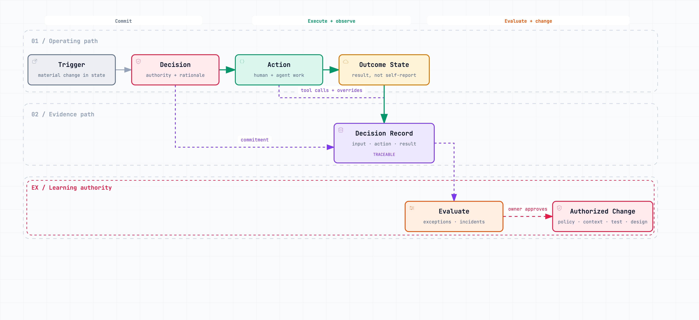

# Observe, Prove, Learn {#sec-observe}

An agent completes a task, the dashboard records success, and the customer leaves.

The tool returned no error. The workflow closed. The answer was fluent. None of those facts proves that the customer received the right result.

Traditional software observability asks whether a system is available, fast, and producing errors. Those signals remain necessary. Agentic work adds another problem: the system can run exactly as built and still pursue the wrong interpretation, use poor evidence, or produce an undesirable business outcome.

ATOM therefore treats evidence as a product of execution. The system must preserve enough of the path to answer three questions:

1. What happened?
2. Did it work for the business and the affected party?
3. What is allowed to change because of what we learned?

{#fig-evidence-learning-loop fig-alt="A workflow from trigger to decision, action, and outcome state. The decision, action, and outcome feed a traceable decision record. Evaluation of the record leads to an authorized change in policy, context, tests, or design." width=100%}

## Record the path and the resulting state

A useful trace connects:

- the triggering request and relevant context versions;
- the model, instructions, tools, and permissions used;
- decisions, tool calls, approvals, denials, and handoffs;
- intermediate and final outputs;
- errors, retries, overrides, and interventions;
- the resulting state in the business system;
- and later customer, operational, or economic outcomes.

The final state matters. Anthropic's example is exact: an agent saying a flight was booked is not equivalent to a reservation existing [@anthropic-agent-evals-2026]. In company operations, “invoice corrected” should connect to the ledger entry. “Customer retained” should connect to subsequent behaviour. “Decision delegated” should connect to who actually made it.

Not every trace needs every token or hidden reasoning step. Excessive capture raises cost, privacy exposure, and review burden. Preserve the events needed to reconstruct authority, inputs, actions, control decisions, and outcomes. Store source references and versions where retaining full content would be inappropriate.

Evidence depth should follow consequence. A brainstorming assistant needs little retention. An agent changing production code, employment status, a customer contract, or a financial record needs durable identity, version, action, and approval evidence.

## Build a decision record, not a transcript archive

The unit of observation should match the operating model. A conversation log tells what was said. A **decision record** tells why the company acted.

A complete record contains the decision identifier, trigger, owner, intent, context manifest, alternatives considered, applicable policy, authority used, commitment, exceptions, evidence expected, and observed result. Model and tool traces attach to that record rather than becoming the record themselves.

This distinction makes evidence usable beyond engineering. Finance can connect a pricing decision to margin. Operations can connect a promised date to capacity and delivery. A business-unit leader can inspect why cases escaped the local envelope. Legal and security can reconstruct which identity used which permission.

It also reduces false confidence. A perfectly logged sequence is not automatically a sound decision. The record keeps the technical path connected to the business consequence.

## Observe five kinds of signal

One dashboard should not attempt to compress the whole loop into a single “agent success” score. Operators need five views.

**Outcome signals** show whether the loop achieved its purpose: resolution, margin, delivery, retained revenue, quality, safety, or another defined result.

**Flow signals** show how work moved: elapsed time, waiting, handoffs, rework, queue depth, and age of unresolved exceptions.

**Agent signals** show behaviour: task success, tool errors, retries, token and monetary cost, latency, unsupported claims, and stop quality.

**Control signals** show authority in action: approvals, denials, policy violations, unusual access, cumulative exposure, overrides, and revocations.

**Learning signals** show whether evidence changes the system: new eval cases, recurring failure clusters, stale-source repairs, policy changes, and time from discovery to validated correction.

Commercial agent platforms already expose parts of this pattern. Intercom's reporting separates involvement, resolution, escalation, customer experience, and content performance [@intercom-fin-reporting-2026]. LangSmith groups production traces and supports analysis by errors, latency, cost, feedback, and other dimensions [@langsmith-insights-2026]. These are useful examples, not complete operating models. A company still has to connect agent telemetry to its own economics and obligations.

## Evaluate before and during use

Offline evaluation tests the system against a controlled set of tasks before release. Online evaluation observes sampled production behaviour, outcomes, and new failure patterns. Neither is sufficient alone.

Begin with real cases. Include normal examples, boundary conditions, known failures, adversarial inputs, and cases where the correct behaviour is to stop. Strip or protect sensitive information, retain the ground truth where it exists, and document where expert judgment is genuinely required.

Different graders answer different questions. Code can verify a database state, calculation, schema, or prohibited tool call. A model can assess an open-ended output against a detailed rubric. Domain experts calibrate judgment and review cases where consequences matter. Production outcomes reveal failures that a laboratory case did not anticipate.

Pass rate alone hides the failure that matters. Segment by customer type, action, risk level, language, data source, business unit, and version. Track tail latency, cost per successful outcome, human intervention, reversal, and evidence completeness. When a model, prompt, tool, source, or policy changes, compare it with the current system on the same cases before expanding authority.

An evaluation set is not permanent truth. Products, customers, policies, and attacks change. Cases that were difficult can become routine, while new boundaries appear. The set needs ownership and a release cadence.

## The correct stop is a success

Teams often score completion as success and escalation as failure. That rewards dangerous behaviour.

If a cost source is stale, a policy conflict exists, or the request lies outside authority, stopping is the desired outcome. Evaluate scope recognition, appropriate refusal, useful escalation, and preservation of safe state. A system that completes 98 per cent of tasks but acts wrongly on the two per cent it should refuse may be worse than one with a lower raw completion rate.

This also changes operational reporting. Escalation rate should be split into legitimate judgment, context failure, policy gap, technical failure, and out-of-scope request. The first category may represent sound design. The others point to different repairs.

## Do not confuse override with error

A high human-override rate may indicate a poor model. It may also indicate a cautious deployment where people correctly handle rare exceptions. A low override rate may mean excellent performance or rubber-stamp review.

The trace needs a reason and an outcome. Did the person possess context unavailable to the agent? Did the policy boundary work? Was the override itself wrong? Was the action later reversed? Without those links, acceptance and override rates become management theatre.

Review a sample of both accepted and rejected recommendations. Accepted cases can contain invisible errors; rejected ones can reveal inconsistent human preferences. Compare people as well as systems. If two experienced reviewers disagree frequently, the evaluation target may be under-specified.

The objective is not to prove that the agent was right. It is to discover what the operating system needs to know.

## Learning requires change authority

Evidence can lead to different changes, owned by different people:

| Finding | Possible change | Owner |
|---|---|---|
| The model fails a known task | Model, instruction, or evaluation | Product/agent owner |
| Required facts are stale | Context source or freshness rule | Data/context owner |
| A tool behaves unpredictably | Integration or tool contract | Platform owner |
| Valid actions violate intent | Policy or authority envelope | Business/control owner |
| Results are consistently poor | Decision design or strategy | Accountable executive |

These authorities should remain separate. The agent that detects a weak policy should not rewrite the policy and expand its own scope. A controlled proposal, review, test, and release path protects the organization from self-reinforcing error.

Learning also needs a threshold. One unusual case may warrant a new test but not a general rule. A repeated cluster may require context or policy change. A persistent outcome failure may invalidate the decision itself. The accountable owner decides which evidence is sufficient for which change.

## Turn incidents into reusable tests

When an incident occurs, preserve the trace and the real result. Reproduce the condition in a safe environment. Determine whether the initiating failure belonged to intent, context, decision design, execution, control, or an external dependency. Add the case to the appropriate evaluation set and decide who owns the correction.

Then test the repair against both the incident and previously reliable behaviour. A new instruction that prevents one refund error may make ordinary customer resolutions worse. A stricter permission may block the incident and also prevent the safe recovery path. Regression tests keep a local fix from becoming a system-wide cost.

The incident review should end with a changed artifact: a source rule, decision specification, tool contract, control, evaluation case, or authority boundary. “Remind the team to be careful” is evidence that the system learned nothing.

## Build the operating view with AI

Do not begin by buying a generic agent dashboard. Start with the decisions and data you already have.

In an approved analytics environment, provide the decision specification, event schema, a sample of traces, outcome data, and current management reports. Ask an AI assistant to:

1. join each trigger to its eventual business state;
2. calculate elapsed time, waiting, retries, handoffs, and reversals;
3. cluster escalations and overrides by reason;
4. identify records whose sources, versions, owner, or outcome are missing;
5. propose outcome, flow, agent, control, and learning panels;
6. generate the SQL, transformation logic, or notebook required for a first dashboard;
7. define alerts for dangerous combinations, such as rising autonomy with falling evidence completeness;
8. create a weekly exception brief linking every claim to the underlying case.

Have the data and outcome owners validate the joins and definitions. Models are useful for building the first analytical surface, but they should not invent ground truth where systems fail to share identifiers.

The weekly review should focus on a small number of decisions and exceptions, not a wall of metrics. Ask whether the company can reconstruct the result, explain why the action was permitted, see whether it worked, and change the correct part of the system. That is observability in service of adaptation.
