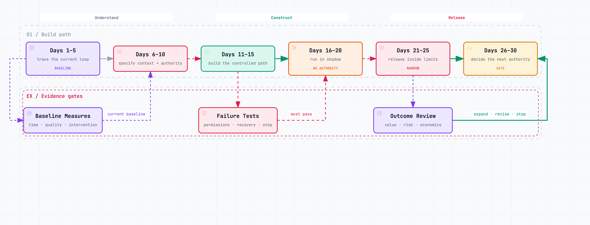

# Build the Minimum Viable Operating Loop {#sec-build-loop}

A demo proves that a model can perform under chosen conditions. A minimum viable operating loop proves that the company can let a system encounter real variation without losing authority or evidence.

The difference is substantial. A demo begins with curated input, ends with an output, and has an expert nearby. A live loop receives incomplete requests, stale records, conflicting policies, system failures, unusual customers, and people under time pressure. It must know what to do when the happy path disappears.

The following thirty-day sequence continues the **illustrative onboarding pilot** from the previous chapter. It is a sequence of design gates, not a promise that every company should deploy in a month. A regulated or high-consequence process may require much longer. A simple internal loop may move faster.

{#fig-thirty-day-loop fig-alt="A six-stage build path covering days 1 to 30: baseline, context and authority, controlled path, shadow operation, narrow release, and the next authority decision. Baseline measures, failure tests, and outcome review act as evidence gates." width=100%}

## Days 1–5: establish the baseline

The owner selects one customer segment and one exception class. The team exports prior cases and reconstructs the current path: trigger, data sources, handoffs, decisions, waiting, rework, outcome, and later repeat contact.

The system record will be incomplete. Operators may search messages for a customer promise, ask finance for a status, or repair data before acting. Sample cases with the people who perform the work and add those hidden steps to the map. This is where operational debt first becomes measurable.

The baseline includes a distribution, not only an average. For onboarding it may include median and tail resolution time, number of touches, handoffs, escalation, reopen rate, time to activation, customer repair, and cost to serve. It separates working time from waiting.

The team then writes the decision-loop charter and names kill conditions. It assigns one accountable owner. Product, operations, data, security, and legal may contribute, but the pilot cannot be governed by collective ambiguity.

An AI assistant can classify historical cases, reconstruct common paths, identify missing joins, and propose the event schema. People correct the categories and outcomes. Those corrections become the first evaluation examples.

**Gate 1:** The team can describe the current loop, its owner, population, outcome, and evidence gaps. If it cannot, the next step is instrumentation—not an agent.

## Days 6–10: design authority and context

The owner specifies what the agent may do. In this pilot it can gather account state, classify the exception, request missing information, and propose a resolution. It cannot change contractual terms or modify an account without approval.

Those verbs need technical meaning. “Gather” grants read access to named fields. “Request” allows a draft or message through an approved channel. “Propose” creates a structured resolution with evidence. “Modify” remains unavailable to the agent credential.

The context envelope lists required fields, source systems, policy versions, precedence, freshness, and access. Missing or conflicting required context produces a stop, not a guessed answer. Sensitive fields are removed unless they change the decision.

The team writes handoff contracts for customer clarification, operations review, and policy exception. Each handoff carries the work already performed and the reason the system stopped. An escalation is routed by its unresolved issue, not sent to a generic manager queue.

The decision owner also defines correct refusal. Examples include an identity mismatch, a strategic account, an active dispute, an expired policy, or a request outside the selected exception class.

**Gate 2:** The agent's view, recommendation scope, action rights, prohibited conditions, and escalation routes are explicit. The business owner and control owners agree that the technical permissions match the written grant.

## Days 11–15: build the controlled environment

The agent receives test credentials with the same shape but less authority than production. Tools validate parameters and return structured results. Logs capture inputs, context versions, calls, outputs, decisions, and errors. Known sensitive actions remain technically unavailable.

The evaluation suite contains routine historical cases, difficult exceptions, contradictory context, missing data, malicious instructions inside customer content, and situations where escalation is correct. Tests check both result and path:

- Did the system classify the case correctly?
- Did it retrieve the authoritative record?
- Did it preserve the original customer constraint?
- Did it avoid prohibited tools and fields?
- Did it stop on an exclusion?
- Did the handoff contain enough state for a person to continue?
- Did the proposed resolution satisfy policy and the expected customer outcome?

Some tests are deterministic. Others need a rubric and domain review. The team records disagreements rather than forcing false ground truth.

The environment also needs budget controls: time, retries, tool calls, token cost, external requests, and cumulative action value. A task that cannot terminate predictably is not ready for production.

The team rehearses failure. Revoke access during a run. Return malformed data. Make one source unavailable. Interrupt after a partial draft. Delay an approval. Attempt an out-of-scope action. Verify that the safe state and recovery route are visible.

**Gate 3:** Operators can observe, interrupt, revoke, recover, and investigate the loop. The system passes the minimum evaluation threshold, including every critical stop case.

## Days 16–20: run in shadow

The system now processes live eligible cases without committing actions. Its proposals are compared with normal handling. Reviewers record disagreement reasons rather than a bare accept or reject.

The owner watches for patterns: one policy misunderstood, one segment poorly represented, one source too stale, one operator applying an undocumented preference, or one type of case consistently routed incorrectly. The objective is not to maximize agreement. It is to find where the system's model of the work differs from reality.

Shadow mode has limitations. People behave differently when nothing can happen. Reviewers may accept proposals casually because the current process remains authoritative. The mode tests scope recognition, context, recommendation quality, and evidence. It does not prove that live controls or economics work.

The team selects a small release population based on observed evidence. It updates evaluation cases and documents every change to context, instructions, tools, or policy.

**Gate 4:** The system behaves reliably on the selected population, identifies cases it should not handle, and produces a useful escalation. Remaining uncertainty is compatible with a narrow live release.

## Days 21–25: release narrowly

The system goes live for a limited share of eligible cases. At first it prepares the exact action and a person approves. Cases outside scope are excluded before the model sees them. Retry, time, cost, and exposure limits are enforced. An on-call owner can pause the loop.

The reviewer sees the customer request, relevant account state, policy, proposed action, uncertainty, and source links. Approving or rejecting requires a reason only when it creates useful learning; the interface should not turn judgment into clerical work.

Daily review focuses on new failure patterns, queue behaviour, and customer outcome. A stale policy goes to the context owner. A failed tool call goes to the platform owner. A sound but unpopular decision goes to the business owner. A permission failure goes to the control owner. Routing the correction prevents every problem from becoming a prompt change.

The owner watches the receiving human queue. If the system processes easy cases quickly while sending a growing pile of ambiguous cases to specialists, capacity and job design have changed. That is part of the pilot economics.

If the system cannot connect its action to the resulting account state, live volume stops. Completion without proof is not sufficient.

**Gate 5:** Real cases show acceptable outcomes, complete evidence, effective controls, and supportable human load. Incidents and complaints can reach an owner and be repaired.

## Days 26–30: decide the next authority

The team compares live cases with the baseline and reads a sample of traces. It includes review time, exception handling, model and infrastructure cost, customer repair, maintenance, and displaced work. Frontline operators and affected customers contribute evidence.

The gate has four outcomes:

- **Expand:** add a defined class of cases, action, or volume.
- **Revise:** repair a named context, decision, control, or reliability gap and retest.
- **Contain:** keep the loop at a stable narrow scope because that is where it creates value.
- **Stop:** retire it because the outcome, economics, risk, or operating burden does not justify continuation.

Expansion is specific. The agent may gain authority to execute one reversible resolution below a limit while continuing to propose the rest. It does not receive a general promotion.

The team also names the evidence that would reduce authority. A new policy, deteriorating source freshness, repeated repair, unusual access, or a model change can return the loop to approval or shadow mode.

**Gate 6:** A normal operating owner accepts the next state, the supporting functions can sustain it, and every granted action has a retirement or rollback path.

## Minimum viable ATOM canvas

Before live action, one page should contain:

| Element | Required statement |
|---|---|
| **Intent** | Outcome, boundary, counter-metric, and learning question |
| **Context** | Sources, freshness, provenance, access, and missing-data behaviour |
| **Decision** | Owner, criteria, consequence, reversibility, and escalation |
| **Execution** | Human, rule, workflow, and agent responsibilities |
| **Evidence** | Trace, result, evaluation, and retention |
| **Learning** | Review cadence and owners of possible changes |
| **Control plane** | Identity, permissions, approvals, stop, rollback, and recourse |

The canvas is complete only when the people operating the loop recognize their real work in it. A polished diagram with no account of manual reconstruction is not complete.

## The small team

A scale-up does not need a large transformation office. It needs the outcome owner; one or two people who perform the work; someone able to build the workflow and data connection; and access to security, legal, finance, or domain expertise when the loop requires them.

One person may hold several roles. What matters is that the accountabilities remain visible. The builder should not decide the business authority. The business owner should not approve a security exception alone. The frontline operator should help define reality but should not be forced to absorb every failure after launch.

Avoid creating a permanent pilot team detached from operations. The people who will inherit the loop should participate before live release. Otherwise the prototype accumulates undocumented credentials, manual repairs, and specialist knowledge that make transfer impossible.

## Ask AI to maintain the build record

Use an approved assistant throughout the month. Give it the charter, canvas, source manifest, decision specification, evaluation results, change log, and incident records. Ask it to maintain:

- the current version of the operating loop;
- open assumptions and their evidence status;
- differences between written authority and technical permissions;
- failures grouped by ATOM layer;
- decisions made and alternatives rejected;
- regression cases generated from each meaningful correction;
- and the evidence required at the next gate.

At each review, ask it to produce a short adversarial brief: what would have to be true for the team to be overestimating value or underestimating risk? The assistant organizes the record. The named owners accept, reject, or change the argument.

A minimum viable operating loop is ready when its authority and evidence are designed, when people can recover from failure, and when a normal owner can imagine taking it into the run. The demo is the easy part.
