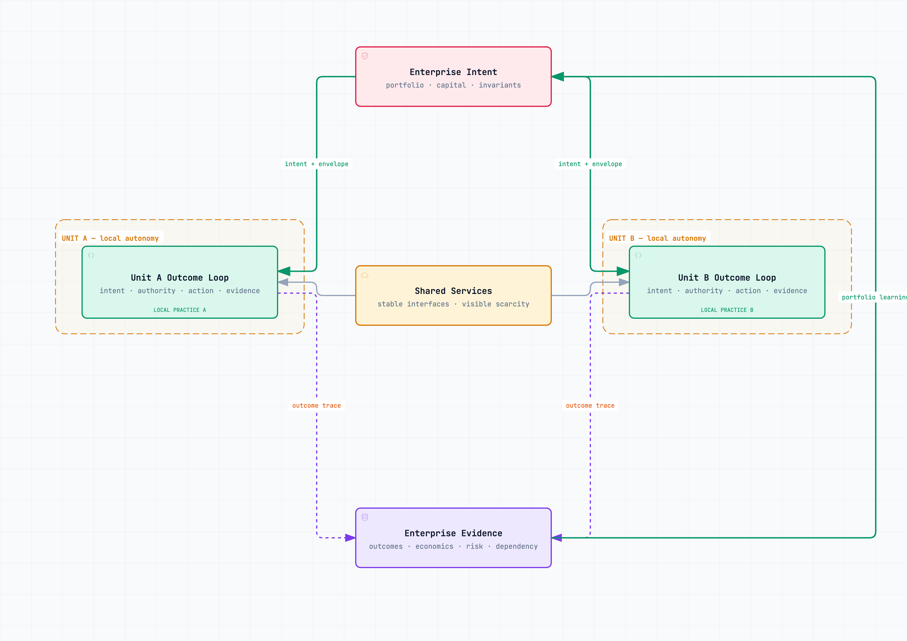

# Fractal Units, Not Fractal Bureaucracy {#sec-fractal-units}

As a company adds business lines, it faces a familiar choice. Centralize decisions and slow the edges, or decentralize and accept duplication. The choice is false when the organization has not specified what must be shared.

This problem can appear early. A forty-person company launches a second offer and appoints a leader. At first the new business borrows sales, product, finance, and operations from the core. Shared people now serve two sets of priorities. The founder may end up resolving conflicts because the interfaces are unclear.

As the company grows, the unit leader may still lack authority over shared capacity or common products. Leaders can respond by duplicating functions inside each business or by adding a central planning layer. Either choice can be costly if it substitutes for a clear decision about interfaces and rights.

This book uses **Fractal Unit** for a semi-autonomous group designed to run a governed outcome loop. The term is a proposed design lens, not a validated organizational form. “Fractal” does not mean every unit is identical. It means the same proposed operating grammar—intent, context, decisions, execution, evidence, learning, and control—can be applied at different scales. This overlaps with established work on team boundaries and platform operating models; the useful question is whether the explicit outcome, authority, evidence, and lifecycle contract helps diagnose a real coordination problem. It is not a claim that the label itself is new.

The repeatable object is not the team diagram. It is the contract.

{#fig-fractal-units fig-alt="Enterprise intent sets an authority envelope for two local outcome loops. Shared services expose stable interfaces and scarcity. Each unit returns outcome evidence for portfolio learning while keeping its own local practice." width=96%}

## A unit earns autonomy by closing a loop

A collection of people is not operationally autonomous just because it has a name, leader, and targets. The unit needs access to outcome evidence, relevant decision rights, execution capacity inside its boundaries, and a way to learn from results.

A growth squad that depends on five functions to approve each experiment may be cross-functional on paper but not autonomous. A business line with its own revenue target but no visibility into fulfilment cost does not own its economics. A regional team that can sell but not resolve customer failures owns acquisition, not the customer outcome.

The unit boundary should follow a result that can be owned coherently. It may be a business, product, customer segment, operational service, or platform. The choice depends on where context is deep, decisions interact, and feedback needs to remain close.

Too small a boundary produces fragments whose local goals compete. Too large a boundary recreates the central company inside each unit. The test is whether the group can run the complete loop without continuously negotiating ordinary work across its edge.

## The unit contract

Every unit should be able to state:

| Element | Contract |
|---|---|
| **Purpose** | Customer or enterprise outcome the unit exists to produce |
| **Economics** | Revenue, cost, margin, assets, or risk it owns and can observe |
| **Inputs and outputs** | What enters, what leaves, and in what form |
| **Decisions** | Rights held locally, shared, and at the centre |
| **Dependencies** | Services and capacities required from others |
| **Context** | Sources and policies required to operate |
| **Controls** | Non-negotiable limits and escalation conditions |
| **Evidence** | Measures, traces, and review obligations |
| **Learning** | What the unit may change and what requires shared approval |
| **Lifecycle** | Conditions to grow, split, merge, or close |

A unit without outcome ownership is a project team. A unit without visible economics is a cost centre pretending to be a business. A unit without bounded rights is a reporting layer.

The contract is reciprocal. The unit commits to outcomes, evidence, and enterprise constraints. The centre and shared services commit to capacity, interfaces, decision latency, and transparent economics. Autonomy cannot mean that the unit is accountable for a result while a central function can silently delay the input it needs.

## Invariants and local choices

Scale depends on making a few things rigid enough that everything else can adapt.

**Enterprise invariants** may include customer identity, financial definitions, security controls, core product interfaces, evidence requirements, and rules for allocating shared assets. Units should not invent their own meaning of active customer or contribution margin. They should not bypass access policy because the central service is slow.

**Local choices** include workflow, roles, experiments, tools, and decisions inside the unit's authority envelope. The centre should resist standardizing them simply because one unit found a successful pattern. Reuse should follow evidence and compatible conditions, not executive preference.

The difficult category lies between them: shared choices with local consequences. Examples include platform priorities, brand promises, field capacity, scarce expertise, and common data products. They need an owner, allocation rule, service interface, evidence, and appeal. A recent meta-analysis found that team boundary management's relationship with performance varies by the kind of boundary activity, its target, and who performs it; spanning activities and extra-organizational targets showed stronger effects in that synthesis [@leicht-deobald-et-al-2025]. This does not validate the Fractal Unit model, but cautions against treating every boundary as an interface to standardize.

An invariant should be few, explicit, and enforceable. If everything is an invariant, the unit is not autonomous. If nothing is, the company becomes a portfolio of incompatible operations.

## Design shared services as products

Calling a function “shared” does not define how it serves the businesses. A shared service needs a purpose, users, service levels, capacity model, cost, prioritization rule, roadmap, and owner.

Finance may provide close, cash, cost definitions, pricing context, and decision support. Those are different services with different time expectations. A product platform may provide identity, billing, data, and deployment capabilities. A physical network may provide reserved capacity, emergency capacity, and maintenance windows.

The interface should expose scarcity. If all requests appear free, demand becomes political. Units over-request, central teams triage through relationships, and the COO becomes the appeal court.

Internal pricing can help but is not the only mechanism. Capacity envelopes, priority classes, explicit queues, and opportunity-cost views may be sufficient. The objective is to make local choices feel the consequence of shared constraints without constructing a complex internal market that costs more than it clarifies.

## Illustrative case: Aster grows into distinct operating needs

Return to Aster, the **fictional** agent-action infrastructure company introduced in Chapter 2. Its figures are chosen for the worked example, not observed performance or a forecast. At 100 customers, its modeled $4.32 million ARR comes from 100 × [$1,500 cloud base + (400 active authority units × $3) + (1.2 million governed operations ÷ 1,000 × $0.75)] × 12. One integrated company could plausibly handle the resulting implementations and exceptions if its queues remain visible and bounded. The customer count alone does not require a new unit.

At 800 customers, the same prices and higher assumed usage yield $79.92 million ARR: 800 × [$1,500 + (1,000 × $3) + (5.1 million ÷ 1,000 × $0.75)] × 12. That is 800,000 active authority units and 4.08 billion governed operations a month. Customer requirements, integrations, support, security reviews, and operating needs may now diverge. If each exception still travels to the founder or one central function, the organization has not grown a corresponding decision capacity.

At 4,000 customers, the modeled revenue is $1.1988 billion ARR, approximately $1.2 billion: 4,000 × [$1,500 + (2,500 × $3) + (21.3 million ÷ 1,000 × $0.75)] × 12. That entails 10 million active authority units and 85.2 billion governed operations a month under the same assumptions. ARR is fifteen times the 800-customer stage. Making every central function fifteen times larger would preserve the same queues and unclear interfaces at greater cost. That is not an operating model.

One possible boundary gives enterprise, growth, regulated-industry, and regional units ownership of distinct customer outcomes. These are options to test, not a prescribed chart; a region may overlap a customer segment, so Aster would need to choose one primary owner for each customer and outcome. Each unit could own its onboarding, service decisions, support path, and local economics inside a stated authority envelope.

The units would reuse a shared core runtime, identity model, evidence format, billing meters, security baseline, common interfaces, and availability and reliability commitments. A shared platform owner must publish capacity, change rules, costs, and incident paths. Units cannot each redefine an active authority unit or count a governed operation differently. Security controls and cross-unit reliability remain enterprise obligations even when a unit handles a customer's case.

A unit's working economic equation is **customers × [cloud base + active authority-unit revenue + governed-operation consumption revenue] − [allocated platform cost + service cost + sales cost + local operating cost]**. The revenue terms are monthly per customer, so the costs must be measured over the same month before comparing them. The optional $7,500 one-time implementation fee, if charged, belongs in a separate implementation account; it is not ARR. Unit leaders need both the recurring revenue and the costs of implementations, reviews, incidents, and support to see whether a segment's growth pays for its operating load.

Suppose a regulated customer requires a new evidence field. The unit can own the customer outcome and specify the need, but it cannot change the shared evidence format alone. The platform owner evaluates the interface change, cost, migration, and effect on other units. The unit contract defines who can decide locally, what service response to expect, and where a contested priority goes. A founder should see a portfolio choice only when the published allocation rule cannot resolve it. Whether these boundaries help must be judged by customer outcomes, unit economics, decision latency, and cross-unit failures—not by the existence of four boxes on an organization chart.

## Decide where work belongs

Place a capability inside a unit when it requires deep local context, changes frequently with the offer, and can be owned end to end. Share it when scale, scarce expertise, risk consistency, or a common asset creates real advantage. Keep it at the centre when the decision sets enterprise intent, allocates capital among units, defines non-negotiable policy, or resolves a conflict the unit cannot legitimately settle.

Five questions improve the choice:

1. Where does the information needed for good judgment live?
2. How often must the capability adapt to the unit's customer or economics?
3. Does duplication create meaningful cost or merely discomfort?
4. Does divergence create enterprise risk or healthy variation?
5. Can the dependency be expressed through a stable interface?

Do not decide from ideology. Centralization can add latency, queues, and context loss. Decentralization can add duplication, inconsistency, and fragmented learning. Make the relevant costs visible in the setting at hand.

A function may also move over time. A new unit can borrow central expertise while its needs remain uncertain, then embed capability when the volume and local context justify it. Another service may centralize after units converge on a common pattern. The lifecycle belongs in the contract.

## The fractal boundary

The fractal idea can become bad management if it is interpreted as endless fluidity.

Frequent reorganization can disrupt relationships, tacit knowledge, and accountability; the cost depends on work and team context. Physical assets do not reallocate like cloud capacity. Some regulated responsibilities may remain centralized even when execution moves. People also need role clarity, development support, and enough continuity to build competence together.

Nor should a small unit reproduce every corporate role. The operating grammar repeats; the bureaucracy does not. A six-person venture does not need miniature finance, legal, HR, and security departments. It needs usable interfaces to those capabilities and clear local decision rights.

A useful starting point is a boundary stable enough for the work, with explicit interfaces. Adaptation can then happen through intent, authority, capacity, and practice; restructure when the work or evidence justifies it.

## Use AI to test the unit design

Give an approved assistant the proposed unit charters, P&L definitions, shared-service catalogues, decision inventory, dependency data, escalation records, and capacity use. Ask it to:

- map decisions that supposedly belong to a unit but routinely travel to the centre;
- identify outcomes whose costs or dependencies sit outside the owner's view;
- find shared services with no service level, allocation rule, or appeal path;
- compare conflicting definitions across units;
- locate duplicate capabilities and test whether the duplication is harmful;
- model two or three boundary options and expose the tradeoffs;
- draft unit contracts with every inferred right clearly marked;
- and simulate a stress event in which two units compete for one constrained asset.

Use the result to conduct a boundary review with the unit and shared-service owners. Do not ask the model to choose the structure. It can expose inconsistency, hidden dependency, and likely failure paths. Leaders must decide which outcomes deserve autonomy and which obligations bind the enterprise together.

The proposal is that a governed outcome loop can recur at different scales. Clear unit contracts and shared interfaces may help align local authority with enterprise constraints; whether they do so in a given company must be evaluated through its actual outcomes and coordination costs.
