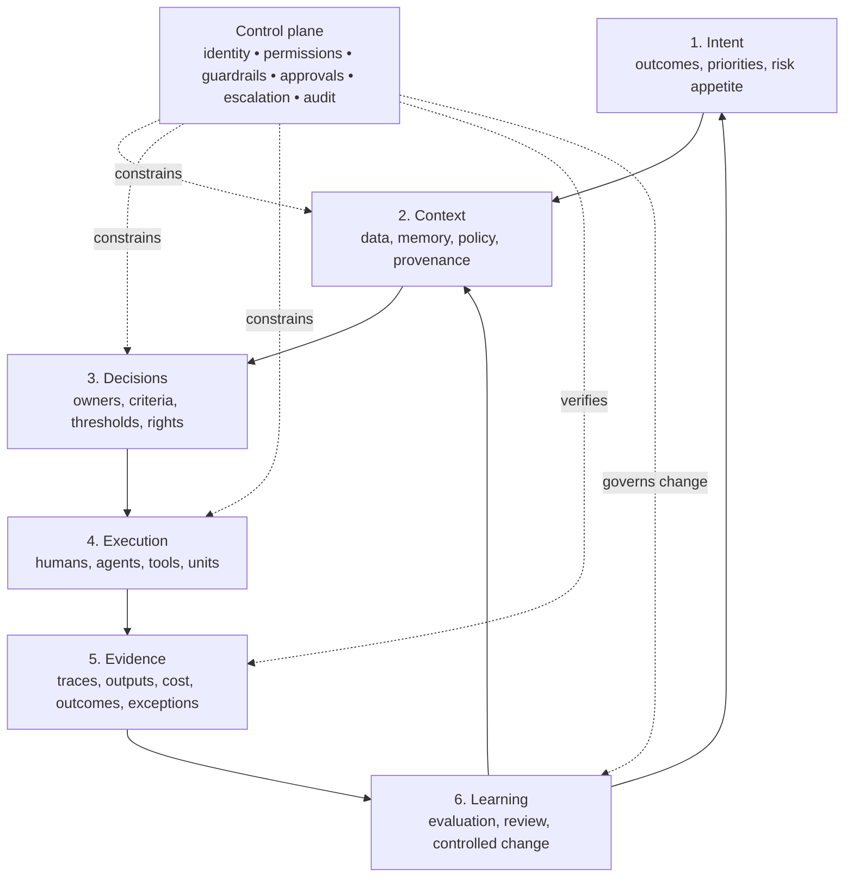

# Original Book Analysis

Status: editorial diagnosis for the 2026 second edition  
Sources reviewed: `ebook v4 en.pdf` in full (51 pages; approximately 17,100 extracted words) and, after author clarification, `ebook v2 en.pdf` in full (62 pages; approximately 12,800 extracted words)  
Editorial rule: preserve the author's thesis, not the generated wording

## Executive judgment

The current book is not yet a publishable business book. It is a concept prototype for an operating-model consulting service. It contains one strong proposition, several promising mechanisms, a large amount of generic transformation language, and almost no evidence.

The strong proposition is this:

> AI does not merely add a new class of tools to a company. Once software agents can interpret context, choose tools, and execute work, the company needs a different operating system for distributing intent, decisions, authority, execution, evidence, and learning.

That proposition deserves a book. The present manuscript does not yet prove it.

The 2025 text repeatedly declares that legacy models are obsolete, ATOM is necessary, and real-time AI will remove friction. It rarely explains the causal mechanism, the boundary conditions, the failure modes, or the implementation choices. ATOM is described through seven “pillars,” multiple role names, a technology stack, fractal units, dashboards, and a playbook, but these pieces do not form a stable architecture. A reader cannot draw ATOM from memory because the book never decides what kind of thing ATOM is.

The second edition should be a reconstruction, not a rewrite. Approximately 15–25% of the original ideas may survive in developed form. Very few sentences should survive unchanged.

## Provenance and implications for the editorial approach

The author has clarified that v2 was a rough first attempt created with GPT-3.5 to explore an operating-model consulting offer. The exercise never developed into a deep model. Comparing v2 and v4 supports that account.

- v2 is an overt consulting draft. It includes placeholders such as “Suggested Visual,” repeated tool recommendations, “CEO Insight” boxes, and sales-oriented promises.
- v4 removes some obvious scaffolding and adds an extended fictional day, agent supervision, an AI Operations Hub, cost metrics, Elements and Compounds, and a closing consulting offer.
- v4 also contains unreconciled generation residue. Page 28 tells the editor to revise section 5.2 and then introduces “the proposed revised text.” Page 49 says, “Think about our collaboration here,” exposing a model-author conversation inside the published voice.
- The shift from v2 to v4 is expansion, not intellectual validation. More specificity was added, but the underlying assumptions were not tested.

Consequences:

1. The original wording has no presumption of preservation.
2. “ATOM” is a hypothesis to be made coherent, not a brand to be defended.
3. Every claim must earn its place through mechanism, evidence, author experience, or explicit hypothesis labeling.
4. The author’s contribution should be recovered through interviews, notes, and practitioner examples during drafting. External research should test and sharpen it, not replace it.
5. The second edition should openly acknowledge the 2025 prototype. “What I believed then / what became clearer” can become a source of credibility.

## Central thesis

### What the manuscript argues

The book argues that the speed, uncertainty, and volume of AI-mediated work make conventional operating models too slow. Hierarchies, periodic planning, static roles, fragmented data, manual coordination, and retrospective governance create “Hidden Operational Debt.” ATOM replaces them with continuous sensing, predictive decision support, fluid teams, distributed authority, embedded guardrails, real-time observability, dynamic talent allocation, and continuous learning.

### What is strong

- It moves the unit of analysis from the AI tool to the organization.
- It recognizes that faster task execution can make coordination, context, decision rights, and control the new constraints.
- It connects autonomy with guardrails and observability instead of treating autonomy as an unconditional good.
- It treats organizational learning and memory as operating functions rather than cultural slogans.
- It anticipates that managers will shift from relaying information and allocating tasks toward setting intent, resolving exceptions, coaching judgment, and owning outcomes.

### What is missing

- A falsifiable definition of ATOM.
- A canonical architecture.
- A theory of change showing why each component produces the claimed result.
- Boundaries: company sizes, work types, regulatory contexts, and decisions for which ATOM is unsuitable.
- A clear distinction between recommendations, automated workflows, model-based agents, and autonomous execution.
- A rigorous account of authority. “Human in the loop” is not a decision-rights model.
- An explicit control plane for identity, permissions, policies, approvals, escalation, audit, and incident response.
- A realistic account of imperfect data, conflicting goals, model error, prompt injection, tool failure, and organizational politics.
- Evidence that the operating model works as a system rather than as a collection of plausible practices.

## What ATOM currently is—and why it is incoherent

The manuscript uses “ATOM” to mean at least six different things:

1. a management philosophy;
2. a seven-pillar operating model;
3. an integrated software platform;
4. an AI “core” or organizational nervous system;
5. a collection of management cadences and dashboards;
6. a branded consulting implementation method.

These meanings cannot remain interchangeable. A model can be enabled by technology without being technology. It can specify roles without becoming an org chart. It can define governance without claiming that governance “emerges” automatically.

Recommended definition for development:

> ATOM is an operating-model pattern for organizations in which humans and software agents co-produce outcomes. It connects strategic intent to bounded decisions and execution, captures evidence from the work, and uses that evidence to improve context, policy, and capability. It does not prescribe a vendor stack, eliminate hierarchy, or automate accountability.

This definition is provisional and must be stress-tested in the second edition.

## Editorial disposition of the core concepts

| Concept | Disposition | Editorial judgment |
|---|---|---|
| Hidden Operational Debt | **KEEP / EVOLVE / VERIFY** | The most distinctive diagnostic concept. Define the debt principal, interest, symptoms, and repayment mechanism. Distinguish it from technical debt, process waste, coordination cost, and organizational debt. Do not claim exponential compounding without evidence. |
| AI-native decision intelligence | **EVOLVE / MERGE** | Rename to **decision architecture**. AI is one input; the essential design problem is how a decision is framed, who owns it, what evidence is required, what authority is delegated, and how outcomes are reviewed. |
| Adaptive organizational structures | **KEEP / EVOLVE** | Retain as a consequence of the model, not a promise of constant reorganization. Stability has value. Specify which interfaces stay fixed while teams change. |
| Human + agent collaboration | **KEEP / EVOLVE** | Central for 2026. Replace vague “partnership” language with task boundaries, autonomy levels, handoffs, review obligations, failure recovery, and accountability. |
| Fluid governance | **MERGE / RENAME** | “Fluid” suggests rules that move when convenient. Use **governance in the work** or **continuous control**: policy and evidence travel with execution, while authority to change policy remains explicit. |
| Organizational fractals / Fractal Units | **KEEP / EVOLVE / VERIFY** | Potentially distinctive, but currently only a renamed team template. Define what repeats at every scale: intent, interfaces, decision rights, controls, evidence, and learning—not identical team shapes. Test whether “fractal” clarifies or decorates. |
| Continuous strategic alignment | **KEEP / EVOLVE** | Replace “real-time strategy” with alignment at the latency the decision requires. Strategy should not thrash with every signal. Distinguish signal, interpretation, decision, and commitment. |
| Dynamic talent allocation | **EVOLVE / CONSTRAIN** | Useful for temporary capability allocation; dangerous as algorithmic people shuffling. Add consent, continuity, team cohesion, learning cost, labor constraints, bias, and human appeal. |
| Real-time observability | **KEEP / RENAME** | Central, but “real-time” is often unnecessary and expensive. Use **decision-grade observability**: timely evidence about agent actions, workflow state, cost, quality, risk, and outcomes. |
| Synthesizer role | **KEEP / EVOLVE** | Promising name for an accountable integrator. Define its scope: maintains intent and context, arbitrates tradeoffs, owns escalations, and accepts outcomes. It must not become a renamed project manager or a universal new job family. |
| Decision rights and guardrails | **KEEP / EXPAND** | Move to the center of ATOM. Separate authority, permission, policy, approval, and accountability. Add reversibility and consequence as autonomy criteria. |
| Learning loops | **KEEP / EXPAND** | Central. Specify what changes after a result: model/prompt, tool, context, policy, process, role, or strategy. Learning without controlled change is drift. |
| Human control over autonomous systems | **KEEP / REFRAME** | “Human in the loop” is too weak. Define accountable owners, intervention points, stop mechanisms, review sampling, escalation, and change authority. |
| AI Operations Hub | **EVOLVE / RENAME** | Keep the function, not necessarily the centralized team. Proposed term: **Agent Operations**. It owns inventory, reliability, cost, evaluations, incident coordination, and control standards; business owners retain outcome accountability. |
| Elements and Compounds | **REMOVE unless proven** | Introduced abruptly on pages 27–28, poorly connected to organizational fractals, and likely to confuse software composition with organization design. Reintroduce only if the author can supply a real mechanism and example. |
| ATOM Playbook | **KEEP / EVOLVE** | Strong implementation artifact. Make it a version-controlled operating repository containing decision records, unit contracts, controls, evaluations, and patterns—not a generic wiki. |
| Adaptability Coach | **MERGE / CONSTRAIN** | Avoid creating a new consulting caste. Coaching is a capability that may sit with existing leaders, enablement staff, or temporary specialists. |
| Value Flow Steering | **MERGE** | The portfolio-allocation function is valid. Use ordinary language unless this role has distinct decision rights that justify a name. |

## Recommended canonical ATOM architecture

The seven original pillars mix mechanisms, outcomes, scaling patterns, and values. Replace them with six layers and one control plane.

Memorable rule: **intent enters; evidence returns**.

What humans control:

- purpose, priorities, risk appetite, and non-negotiable constraints;
- assignment of decision ownership and agent authority;
- approval of high-consequence or hard-to-reverse actions;
- exceptions, conflicts, ethical judgment, and policy changes;
- acceptance of outcomes and accountability to affected people.

What agents may do:

- gather and transform authorized information;
- generate options and predictions with provenance;
- execute low-consequence, reversible work inside explicit permissions;
- request approval or escalate when confidence, authority, or policy limits are reached;
- emit evidence sufficient to reconstruct what happened.

What ATOM is not:

- a single software platform;
- a license to automate every decision;
- a promise of hierarchy-free work;
- a replacement for strategy, management, law, or professional judgment;
- an always-on employee surveillance system;
- a vendor stack or a new Agile scaling framework;
- a claim that all decisions should happen in real time.

## Chapter-by-chapter diagnosis

### Chapter 1 — Reinventing Organizations for the AI Era

Purpose: establish urgency, attack legacy operating models, and introduce ATOM.

**KEEP**

- The move from adding tools to rewiring the operating model.
- The idea that execution speed can outrun planning and approval cycles.

**MERGE**

- Merge with Chapter 2. Both chapters repeat the same “world is faster / legacy is slow / ATOM is necessary” sequence.

**REMOVE**

- “The wave is here,” “AI is oxygen,” “AI-first powerhouse,” “adapt or be left behind,” and similar threat-based sales language.
- The movie-rental illustration. It explains digitization, not an agentic operating model.

**VERIFY**

- “One year of AI-driven change feels like a decade.”
- “15 days of AI development” equals five months of traditional change.
- Claims that Agile-at-scale models are obsolete as a category.

**NEW MATERIAL NEEDED**

- A specific mechanism: when production becomes cheaper, decision latency and organizational context become binding constraints.
- Evidence showing heterogeneous gains rather than inevitable acceleration.
- Boundary cases where existing structures remain appropriate.

### Chapter 2 — The Core Crisis: Speed, Friction, and Hidden Costs

Purpose: name Hidden Operational Debt.

**KEEP**

- The core term and examples: waiting, duplicate work, lost decisions, workarounds, and approval latency.

**EVOLVE**

- Define operational debt as a stock created by unresolved design compromises that imposes recurring coordination and decision cost.
- Add a debt register: symptom, underlying liability, recurring interest, risk, owner, repayment experiment.

**REMOVE**

- The iceberg as the entire explanation. It is a familiar metaphor, not a model.
- Claims that debt grows “exponentially” or becomes an “existential risk” in every organization.

**VERIFY**

- The v2 calculation that a ten-person weekly meeting costs “over 500 hours” annually is arithmetically plausible but rhetorically trivial and omits value created.

**NEW MATERIAL NEEDED**

- A taxonomy: context debt, decision debt, integration debt, control debt, knowledge debt, and coordination debt.
- How AI can both repay and create operational debt.
- A practical diagnostic and baseline measures.

### Chapter 3 — ATOM in Action: The AI-Native Reality

Purpose: dramatize the future through Anya, list seven pillars, and compare organizational levels.

**KEEP**

- A narrative walkthrough can make the system concrete.
- The Synthesizer as an accountable integrator.
- Strategy, execution, and learning as connected flows.

**EVOLVE**

- Relabel Anya’s day as an **illustrative composite**, not “the emerging reality.”
- Replace effortless automation with normal operating friction: missing context, conflicting evidence, a failed tool call, an approval, and a human override.
- Replace the seven pillars with the canonical architecture.

**REMOVE**

- Decorative clock-time detail and claims of a guaranteed 35-hour week.
- Invented precision: 34% supplier failure, 83% strategy success, $500,000 earmarking.
- “Meeting bloat simply doesn’t exist” and other utopian absolutes.

**VERIFY**

- Whether any real organization dynamically forms ten-person teams, reallocates budgets, and provisions workspaces on this cadence.

**NEW MATERIAL NEEDED**

- Autonomy levels, handoff contracts, control points, evidence artifacts, and the distinction between a recommendation and an authorized action.

### Chapter 4 — Implementing ATOM Successfully

Purpose: readiness, implementation roadmap, technology capabilities, governance, and workforce.

**KEEP**

- Start with a bounded pilot.
- Assess organizational, human, data, and technical readiness.
- Select capabilities, not an “ATOM platform.”
- Embed controls into workflows.

**EVOLVE**

- Split into several chapters: pilot selection, minimum viable operating loop, and 90-day proof/expansion.
- Treat technology as architecture and interfaces: models, tools, context sources, identity, permissions, workflow state, traces, and evaluation.
- Replace “human supervision” with an autonomy and accountability design.

**REMOVE**

- The claim of “irreversible momentum in 10 weeks.”
- The week-10 target that more than 50% of an area is operating under ATOM.
- Vendor shopping lists from v2 and transient examples in v4.
- AI sentiment surveillance as a default management instrument.

**VERIFY**

- All implementation timings and outcome percentages.
- Page 16’s orphan citation marker `[cite: 180, 1869-1872]` has no recoverable source and must not survive.

**NEW MATERIAL NEEDED**

- Pilot selection criteria: value, evaluability, boundedness, reversibility, data readiness, risk, sponsor, and workflow owner.
- Agent boundary worksheet, decision-rights matrix, guardrail template, and kill/rollback design.
- A credible 30/60/90-day roadmap with exit criteria rather than promised outcomes.

### Chapter 5 — Scaling ATOM Sustainably

Purpose: define Fractal Units and scale coordination, alignment, talent, learning, and knowledge.

**KEEP**

- Units should carry a repeatable operating contract.
- Stable interfaces can allow local adaptation.
- The playbook should evolve through validated local learning.

**EVOLVE**

- A Fractal Unit should repeat decision and control logic, not clone an org chart.
- Unit contracts should specify mission, inputs, outputs, interfaces, rights, permissions, evidence, measures, and escalation.
- Treat team formation as a sociotechnical decision, not instant algorithmic matching.

**REMOVE**

- The raw editorial prompt and duplicate section opening on page 28.
- “50 years of change compressed into 5.”
- “Matrix Download,” “AI whisperer,” and other borrowed pop-culture or marketing phrases.
- Elements and Compounds unless a concrete author-derived case proves their value.

**VERIFY**

- Claims that dependency mapping, team formation, onboarding, and skill verification can be automatic and accurate at scale.

**NEW MATERIAL NEEDED**

- Failure modes: dependency explosion, local optimization, duplicated agents, context leakage, permission sprawl, accountability gaps, and learning contamination.
- The economics of shared versus local agent capabilities.

### Chapter 6 — Measuring Success

Purpose: make human-agent work observable, measure agents and system health, introduce AI Operations, and close action loops.

**KEEP**

- This is the most prescient chapter in v4.
- Cost, latency, quality, error, business outcome, drift, recovery time, and override reasons all matter.
- Agent oversight is an operating responsibility, not merely an IT task.

**EVOLVE**

- Move from dashboards to evidence architecture: traces, tool calls, approvals, policy decisions, versions, inputs, outputs, incidents, and outcome linkage.
- Rename AI Operations Hub to Agent Operations unless centralization is proven necessary.
- Distinguish model evaluation, agent evaluation, workflow evaluation, and business outcome evaluation.
- Measure accepted value and residual risk, not “cost per insight” in isolation.

**REMOVE**

- Acceptance rate as a proxy for agent quality. High acceptance may mean automation bias.
- Human override frequency as inherently negative. Overrides can be a sign that controls work.
- Communication-pattern and sentiment monitoring without a necessity, consent, privacy, and labor-relations analysis.

**VERIFY**

- Any claim that correlation between agent use and business performance establishes impact.

**NEW MATERIAL NEEDED**

- Evaluation sets, trace review, counterfactuals, audit evidence, incident taxonomy, rollback, red-team exercises, and proof-of-work requirements.

### Chapter 7 — Leading the AI-Native Operating System

Purpose: describe distributed leadership, context over control, human-agent standards, momentum, and future co-design.

**KEEP**

- Leadership supplies intent and boundaries.
- Local authority requires context and explicit decision rights.
- Managers should be evaluated on system quality and outcomes, not information relay.

**EVOLVE**

- Explain how managerial work changes when coordination and first-draft production become cheaper.
- Replace “everyone is a leader” with named accountability.
- Treat context as a maintained product with owners, freshness, provenance, and access rules.

**REMOVE**

- Repetition of dashboards, OKRs, coaching, and AI summaries from Chapters 4–6.
- “Our collaboration here” on page 48–49.
- The “Molecule OS” teaser unless it is a real, developed author concept.
- Claims that humans should “let go” of designing the future.

**NEW MATERIAL NEEDED**

- What remains irreducibly human: legitimacy, accountability, value conflicts, care, negotiation, consequences, and institutional judgment.
- How leaders prevent delegation from becoming abdication.

### Chapter 8 — Your Path Forward

Purpose: recap the playbook, call for action, and sell consulting services.

**KEEP**

- The living playbook as the operational repository.
- A short practical starting sequence.

**MERGE**

- Move the playbook into implementation and the closing checklist into the conclusion/resources.

**REMOVE**

- The sales funnel, “Let’s Talk,” engagement duration, and qualification language.
- Repetitive claims that ATOM is powerful, essential, or transformative.

**NEW MATERIAL NEEDED**

- A neutral author note.
- A 30-day checklist and 90-day roadmap with downloadable resources.

## Recurring concepts and terminology

The book repeatedly uses the following terms, often without stable definitions:

- ATOM / operating system / AI core / organizational nervous system;
- AI-native, AI-first, AI-driven, AI-powered, AI-enhanced;
- real-time, predictive, dynamic, adaptive, continuous, fluid;
- value stream, Pod, Fractal Unit, Element, Compound;
- Synthesizer, Adaptability Coach, Value Flow Steering, AI Operations Hub;
- guardrails, distributed leadership, decision intelligence;
- dashboards, OKRs, scenario modeling, talent marketplace;
- learning loop, Playbook, strategic alignment, system health;
- Hidden Operational Debt.

The density of coined or capitalized terms exceeds their explanatory value. The second edition should maintain a controlled glossary. New names are allowed only when they identify a mechanism that ordinary language cannot express as precisely.

## Repetition and structural problems

The same claims recur across nearly every chapter:

- quarterly reports become real-time dashboards;
- annual plans become continuous alignment;
- hierarchies become fluid teams;
- approval chains become local decisions;
- AI finds bottlenecks and reallocates resources;
- AI summarizes meetings;
- personalized learning happens in the flow of work;
- governance predicts risks;
- leaders provide context rather than control.

Repetition substitutes for development. Each concept is announced several times but rarely examined once in depth. Transitions mostly recap the preceding section and promise that the next one will make ATOM practical. The book therefore feels circular despite its linear chapter numbering.

Recommended remedy: assign each mechanism one definitional home, then use cross-references. A chapter may apply a concept but must not redefine it.

## Generic AI language and consultant-speak

Patterns to remove throughout:

- artificial urgency: “the wave is here,” “survival demands,” “obsolete,” “immediate,” “now”;
- absolute benefits: “frictionless,” “instantly,” “seamless,” “infinite scalability,” “future-proof”;
- pseudo-precision without evidence;
- repetitive contrast templates: “The Old Way / With ATOM”; 
- performative clarity markers: “clearly,” “explicitly,” “systematically,” especially pervasive in v2;
- personified system claims: ATOM “sees,” “knows,” “restructures,” “optimizes,” and “ensures” without an owner or implementation;
- consulting labels that rename familiar functions without adding decision rights;
- empty intensifiers: “fundamentally,” “dramatically,” “profound,” “unprecedented,” “critical,” “crucial.”

## Places that sound or demonstrably are AI-generated

- Page 28: direct editing instructions and “proposed revised text.”
- Page 49: explicit reference to human-model collaboration.
- Page 9: parenthetical design note requesting a dashboard mockup.
- Page 16: broken citation placeholder.
- Formulaic section structure and repeated “Here’s how” transitions.
- Excessive balanced lists, slogan endings, and redundant summaries.
- Implausibly comprehensive, effortless automation described without edge cases.
- Invented numbers used to simulate realism.
- The v2 manuscript’s repeated “clearly,” “explicitly,” “systematically,” “CEO Insight,” and “Suggested Visual” scaffolding.

These are not merely style defects. They obscure responsibility and allow assertions to pass as mechanisms.

## Unsupported quantitative and factual claims

The following must be deleted, sourced, or explicitly labeled as illustrative:

| Claim | Location | Required action |
|---|---|---|
| One AI year equals ten traditional years | v2 p.1; v4 p.4 | **REMOVE**; metaphor presented as measurement. |
| Fifteen AI days equal five traditional months | v2 p.1; v4 p.4 | **REMOVE**. |
| 34% chance of supplier failure | v4 p.8 | **LABEL ILLUSTRATIVE** and explain model uncertainty. |
| $500,000 contingency earmarked overnight | v4 p.8 | **LABEL ILLUSTRATIVE**; specify approval authority. |
| 83% probability Strategy B succeeds | v4 p.9 | **REMOVE or challenge**; strategic probabilities are rarely this clean. |
| Sustainable 35-hour week | v4 pp.8, 10 | **REMOVE as outcome claim**; may remain an explicit design target. |
| Irreversible momentum in ten weeks | v4 p.19 | **REMOVE**. Irreversibility is undesirable in a pilot. |
| 30% faster decisions | v4 p.19 | **LABEL EXAMPLE TARGET**, never result. |
| 50%+ of target area converted by week ten | v4 p.19 | **REMOVE**. |
| 70% probability of next-week bottleneck | v4 p.22 | **LABEL ILLUSTRATIVE** and include calibration requirements. |
| Fifty years of change compressed into five | v4 p.27 | **REMOVE**. |
| AI can continuously and accurately infer sentiment, burnout, skill, fit, and alignment | throughout | **VERIFY / CONSTRAIN**; address privacy, bias, validity, and consent. |
| Dynamic funding based on predictive ROI | pp.21–22 | **EVOLVE**; describe a controlled decision process, not autonomous truth. |
| Fractal scaling reduces complexity by replication | Chapters 5/6 | **HYPOTHESIS** until demonstrated. |

## Predictions viewed from 2026

### Became more important

- **Agents and tool use.** The original’s move from copilots toward agents is directionally correct. Production systems now make tool permissions, runtime isolation, and approval decisions operating-model issues, not just engineering details.
- **Evidence and auditability.** The book mentions observability but underestimates the need to reconstruct intent, tool calls, approvals, policy decisions, and results. Agent-aware telemetry is now a concrete control pattern.
- **Identity and delegated authority.** The 2025 book barely addresses who an agent is acting for, which credentials it uses, or how authority is revoked. In 2026, NIST is explicitly treating agent identity, authorization, auditing, and non-repudiation as open enterprise problems.
- **Evaluation.** Monitoring uptime and drift is insufficient. Agent performance is path-dependent and must be evaluated at task, workflow, and outcome levels.
- **Context and memory.** Context is not a magic knowledge graph. It is governed operational infrastructure with provenance, access controls, expiry, and contamination risks.
- **Cheap software creation.** Faster production raises the cost of choosing, integrating, reviewing, securing, maintaining, and retiring software. This strengthens the operating-system thesis.
- **Control as enablement.** Permissions, sandboxes, policy enforcement, and approvals are what make meaningful autonomy possible.

### Directionally correct but overstated

- Coding and other agents can execute multi-step work, but capability is jagged and reliability falls on messy, high-context, multi-task work.
- Smaller teams may produce more output in some domains, but output is not value; review, integration, maintenance, and accountability remain.
- Managers may spend less time on coordination, but meetings and cross-person dependencies do not disappear automatically.
- Costs for some model capabilities have fallen sharply, but total system cost includes inference, tools, data, orchestration, evaluation, failures, security, and human review.

### Aged badly

- Static vendor stacks and brand lists.
- The assumption that dashboards equal decision intelligence.
- Automatic talent matching presented as neutral and desirable.
- “Predictive governance” as if models can remove uncertainty from strategy.
- The promise that AI will detect burnout through passive monitoring.
- Claims that most planning should become daily or “real-time.” Faster feedback can also create noise and strategic thrashing.

### Predictions that can now be tested

- **More capable agents:** yes, especially in well-scoped software tasks, but capability is uneven and benchmark performance does not imply job-level autonomy.
- **Autonomous execution:** observable in bounded environments; still requires isolation, permissions, approvals, evidence, and review.
- **Faster knowledge work:** supported in some tasks and populations, contradicted in others. The correct claim is heterogeneous impact.
- **Fewer coordination costs:** individual email/document behavior can change without meeting behavior changing. Tool adoption alone does not redesign interdependent work.
- **AI oversight as an operating function:** increasingly validated by concrete enterprise controls and agent telemetry.
- **MCP-like integration:** the rise of standardized tool/context protocols supports the architecture thesis, while their authorization evolution demonstrates that connection without control is incomplete.

Initial primary evidence for these judgments is recorded in `docs/research/sources.md`. These observations are an editorial research baseline, not the final evidence pass.

## Diagrams and visual system

### Retain as ideas, redesign completely

- Hidden Operational Debt iceberg (v4 p.7): convert into a causal debt model and diagnostic, not a decorative iceberg.
- ATOM circular model (v4 p.6): replace with the canonical six-layer architecture and control plane.
- Strategy / data / AI core / teams stack (v4 p.12): merge into the canonical architecture.
- Readiness staircase (v4 p.15): replace with a readiness matrix and entry criteria.
- Fractal Unit diagram (v4 p.26): replace with a unit contract showing interfaces, decisions, controls, and evidence.
- AI oversight interaction model (v4 p.40): redesign as business owner / Agent Operations / risk-control responsibility map.
- Distributed leadership nodes (v4 p.43): merge with the decision-rights and fractal-unit diagrams.

### Remove

- The AI wave cover and generic stock/generated AI illustrations.
- The movie-rental comparison.
- Decorative “AI core,” talent ecosystem, and futuristic dashboard images that add no explanatory content.

All new diagrams should be Mermaid where practical, use the same controlled vocabulary, have descriptive captions and alt text, and survive in grayscale for PDF/EPUB.

## Distinctive ideas to protect

1. **The company—not the task—is the unit of transformation.**
2. **Hidden Operational Debt** as the drag created by accumulated context, decision, coordination, integration, and control liabilities.
3. **Intent enters; evidence returns.** The operating model closes the loop between strategy and proof of work.
4. **Synthesizer** as accountable integrator of intent, context, exceptions, and outcomes.
5. **Fractal Units** as units that repeat an operating contract while adapting locally.
6. **The Playbook as executable institutional memory.** It should contain operational contracts and decision records, not slogans.
7. **Human accountability survives automation.** Agents may execute authority; humans and institutions remain answerable for granting it and accepting consequences.

## Concepts needing examples or evidence

- A real decision that becomes faster because context, rights, and controls are redesigned.
- A failed agent execution and the evidence needed to diagnose it.
- A before/after operational-debt register.
- One bounded coding-agent workflow and one non-software workflow.
- An autonomy decision based on consequence and reversibility.
- A Fractal Unit contract and an interface failure between two units.
- A governance exception: the agent cannot proceed and a Synthesizer resolves it.
- An evaluation that changes a prompt/model/tool and a policy change that requires separate authority.
- A case where AI increases output but worsens system outcomes.
- A case where a stable hierarchy is the correct design.

## Final disposition

**KEEP** the thesis, operational debt, bounded distributed authority, human-agent execution, evidence, learning, the Synthesizer hypothesis, and the fractal-unit hypothesis.

**EVOLVE** ATOM into a six-layer operating architecture with one cross-cutting control plane.

**MERGE** repeated material on dashboards, alignment, governance, coaching, and leadership into chapters with one clear conceptual owner.

**REMOVE** the consulting sales funnel, vendor catalogues, utopian day, invented statistics, raw prompt residue, decorative diagrams, false urgency, and most branded role proliferation.

**VERIFY** every number, company claim, productivity assertion, regulatory statement, and technical capability.

**NEW MATERIAL NEEDED** includes evidence, counterexamples, failure modes, architecture, decision rights, agent identity and permissions, evaluation, proof of work, concrete artifacts, and honest author experience.

The manuscript’s problem is not that it was written roughly. Its problem is that it announces a model before doing the work required to make the model real. The second edition should do that work in public.
