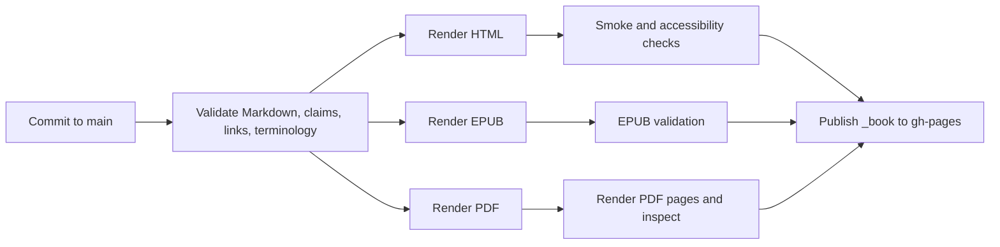

# Proposed Repository Structure

Status: proposed for approval; only planning files and task scaffolding are created in this phase

## Decision

Use Quarto unless the proof build uncovers a blocking cross-format defect. Quarto directly supports the required HTML book, full-text search, EPUB, PDF, responsive navigation, references, Mermaid, downloadable formats, and GitHub Pages deployment from one source project.

Alternatives considered:

| System | Advantage | Why not recommended |
|---|---|---|
| MkDocs Material | Excellent documentation website and search | EPUB/PDF require a second publishing path; book semantics are weaker. |
| mdBook | Fast, simple web books | EPUB/PDF and citation workflows need additional tooling. |
| Sphinx | Mature references and extensibility | Heavier authoring model and weaker fit for an executive nonfiction book. |
| Astro/Next.js + Pandoc | Maximum web control | Creates a custom publishing system the author must maintain. |
| Quarto | One source for HTML, EPUB, and PDF; citations; Mermaid; GitHub Pages | Requires version pinning and PDF/EPUB visual QA, but no compelling blocker is known. |

The project should publish from a generated `_book/` directory to the `gh-pages` branch. Do not use `docs/` as Quarto’s output directory because `docs/` contains editorial and research records.

## Proposed tree

```text
reinvented-by-ai/
├── README.md
├── PLAN.md
├── CHANGELOG.md
├── CONTRIBUTING.md
├── LICENSE
├── CITATION.cff
├── _quarto.yml
├── _brand.yml
├── .gitignore
├── .markdownlint.yml
├── book/
│   ├── index.qmd
│   ├── preface.qmd
│   ├── part-1-the-constraint-moved/
│   │   ├── 01-when-production-gets-cheap.qmd
│   │   ├── 02-hidden-operational-debt.qmd
│   │   └── 03-tools-do-not-change-the-operating-model.qmd
│   ├── part-2-the-atom-model/
│   │   ├── 04-intent-in-evidence-out.qmd
│   │   ├── 05-context-is-infrastructure.qmd
│   │   ├── 06-design-the-decision-before-the-agent.qmd
│   │   └── 07-human-agent-execution.qmd
│   ├── part-3-how-the-system-runs/
│   │   ├── 08-a-week-inside-an-adaptive-company.qmd
│   │   ├── 09-governance-in-the-work.qmd
│   │   └── 10-observe-prove-learn.qmd
│   ├── part-4-build-the-first-loop/
│   │   ├── 11-choose-a-decision-not-an-ai-project.qmd
│   │   ├── 12-build-the-minimum-viable-operating-loop.qmd
│   │   └── 13-prove-value-before-you-expand.qmd
│   ├── part-5-scale-without-losing-the-plot/
│   │   ├── 14-fractal-units-not-fractal-bureaucracy.qmd
│   │   └── 15-allocate-capital-talent-and-knowledge.qmd
│   ├── part-6-control-and-leadership/
│   │   ├── 16-agent-operations-control-at-scale.qmd
│   │   ├── 17-the-manager-after-coordination-gets-cheap.qmd
│   │   └── 18-accountability-cannot-be-delegated.qmd
│   ├── conclusion.qmd
│   ├── author.qmd
│   ├── glossary.qmd
│   ├── references.qmd
│   ├── references.bib
│   └── resources/
│       ├── index.qmd
│       ├── atom-architecture.qmd
│       ├── operational-debt-diagnostic.qmd
│       ├── operating-model-canvas.qmd
│       ├── decision-rights-matrix.qmd
│       ├── agent-autonomy-matrix.qmd
│       ├── context-envelope.qmd
│       ├── guardrail-template.qmd
│       ├── pilot-selection-worksheet.qmd
│       ├── observability-scorecard.qmd
│       ├── human-agent-responsibility-map.qmd
│       ├── fractal-unit-contract.qmd
│       ├── agent-registry.qmd
│       ├── atom-maturity-model.qmd
│       ├── first-30-days-checklist.qmd
│       └── 90-day-roadmap.qmd
├── assets/
│   ├── cover/
│   ├── diagrams/
│   │   ├── source/
│   │   └── rendered/
│   ├── images/
│   └── social/
├── styles/
│   ├── book.scss
│   ├── book-dark.scss
│   ├── epub.css
│   └── typst/
├── docs/
│   ├── editorial/
│   │   ├── original-book-analysis.md
│   │   ├── audience-and-positioning.md
│   │   ├── second-edition-outline.md
│   │   ├── repository-structure.md
│   │   ├── style-guide.md
│   │   ├── terminology.md
│   │   └── quality-report.md
│   ├── research/
│   │   ├── sources.md
│   │   ├── claims.csv
│   │   └── case-study-register.md
│   └── decisions/
│       ├── 0001-publishing-system.md
│       ├── 0002-canonical-atom-model.md
│       └── 0003-case-labels.md
├── tasks/
│   ├── README.md
│   ├── ch01/
│   │   ├── 01-audit.md
│   │   ├── 02-research.md
│   │   ├── 03-argument-map.md
│   │   ├── 04-first-draft.md
│   │   ├── 05-evidence-pass.md
│   │   ├── 06-style-pass.md
│   │   ├── 07-editorial-review.md
│   │   └── 08-finalize.md
│   └── ch02/ ... ch18/
├── archive/
│   └── 2025/
│       ├── README.md
│       └── source-files-added-only-with-author-approval
├── scripts/
│   ├── build/
│   │   ├── render-all.sh
│   │   └── package-downloads.sh
│   └── validation/
│       ├── check-claims.py
│       ├── check-links.py
│       ├── check-terminology.py
│       ├── check-case-labels.py
│       └── quality-gate.py
├── tests/
│   ├── fixtures/
│   └── expected/
├── .github/
│   ├── ISSUE_TEMPLATE/
│   └── workflows/
│       ├── validate.yml
│       └── publish.yml
└── _book/                 # generated, ignored; deployed to gh-pages
```

## Important implementation choices

### One canonical source

All publishable prose lives in `.qmd` files under `book/`. EPUB and PDF are outputs, never manually edited forks. Markdown syntax should remain as portable as possible.

### Editorial work stays private from the reading flow

`docs/` is version-controlled and public for transparency, but it is not part of the book navigation. Editorial diagnoses, rejected claims, research status, and decision records remain inspectable without interrupting readers.

### Rendered output is not committed to `main`

`_book/` is ignored. GitHub Actions renders from a pinned Quarto version and publishes the result to `gh-pages`. EPUB and PDF are copied into the HTML download area and may also be attached to tagged GitHub Releases.

### PDF engine

Start with Quarto’s Typst book output because it reduces LaTeX dependency weight and is supported by current Quarto book documentation. Run a proof build early. Fall back to LaTeX only if Typst cannot satisfy footnotes, cross-references, page breaks, accessibility, or the selected typography.

PDF is technically feasible in CI even though Quarto is not installed locally at this planning stage. “Feasible” becomes “accepted” only after a rendered-page QA pass.

### Diagrams

- Mermaid is canonical for system, flow, responsibility, and sequence diagrams.
- Source lives in `assets/diagrams/source/` when diagrams are too large for inline blocks.
- Rendered SVG/PNG fallbacks live in `assets/diagrams/rendered/` only when EPUB/PDF requires them.
- Each diagram has alt text, a textual explanation, and a grayscale test.
- Generated decorative AI art is not part of the visual system.

### Resources

Each resource is authored in `.qmd` and rendered both as a web page and, where useful, as a print-friendly PDF. Editable CSV/XLSX versions may be added only when interactivity or calculation justifies them.

### Archive

The two source PDFs should not be copied into a public repository until the author confirms that all text, images, fonts, and embedded assets may be redistributed. If approved, preserve them under `archive/2025/` with checksums and a provenance note. If not, store only bibliographic metadata, checksums, and the editorial comparison.

### Licensing

Do not guess. Before public release the author must choose:

- a content license for the book (for example, all rights reserved or a Creative Commons license);
- a code license for build scripts and templates;
- permissions for real cases, author experiences, and third-party figures.

### Research data

`sources.md` is the human-readable ledger. `claims.csv` later becomes the validation index with stable claim IDs, chapter, status, source, checked date, and reviewer.

## Initial `_quarto.yml` intent

The later publishing phase will configure:

- `project.type: book`;
- HTML, EPUB, and Typst/PDF formats;
- numbered chapters and part divisions;
- full-text search;
- repository/edit/source links;
- light and dark HTML themes;
- bibliography and citation style;
- cover and social metadata;
- downloadable EPUB/PDF links;
- canonical URL once the GitHub owner and repository name are known;
- accessible language, alt text, headings, color contrast, and navigation.

## Publication workflow



The GitHub Action should fail closed: a broken format, missing source, invalid case label, or failed quality check prevents publication.

## Repository naming

Working local name: `reinvented-by-ai`.

Recommended public repository name after title approval: `the-adaptive-company`. Preserve “Reinvented by AI” in the edition history and tags.
